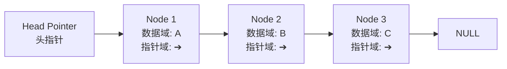
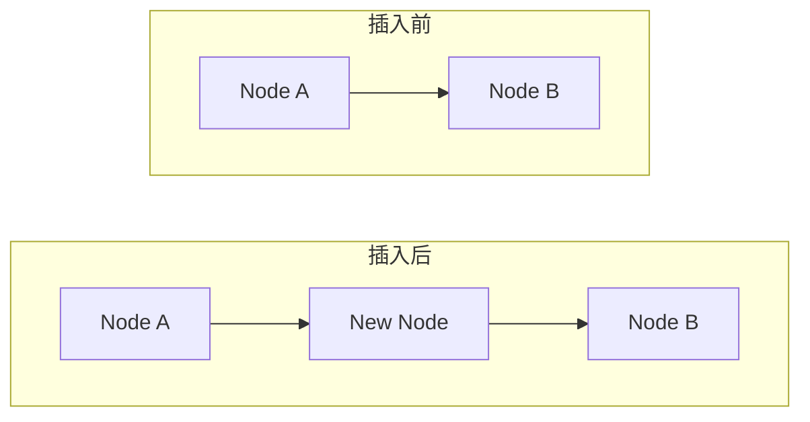
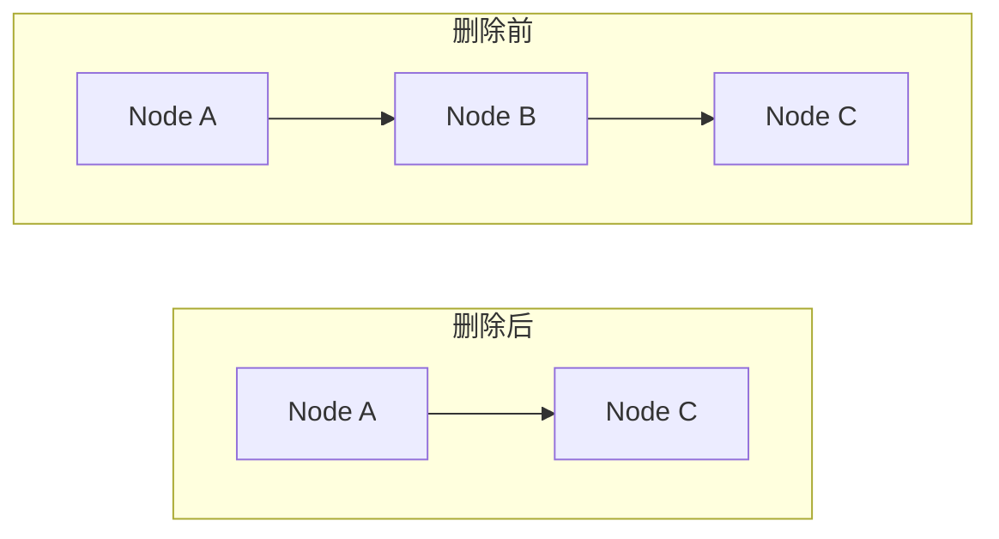
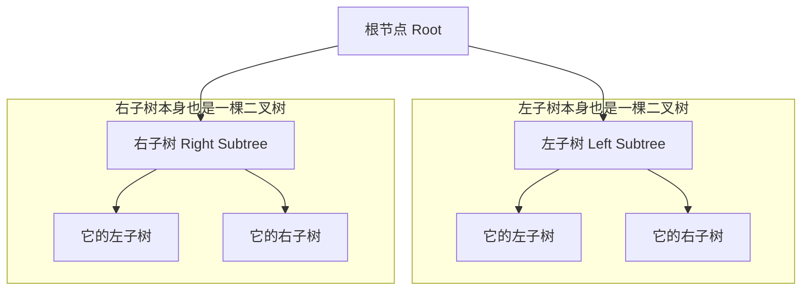
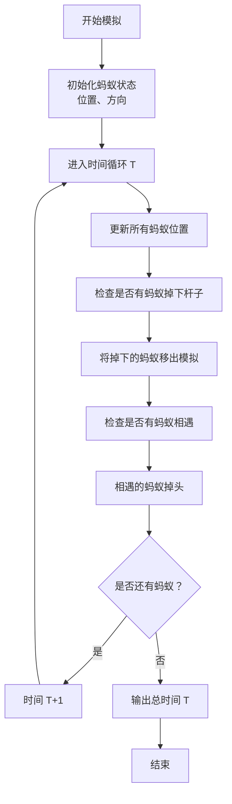

<!-- more -->
::: info
此处存放的一些常用基础算法、数据结构。
:::

## 一、哈希
### 核心思想：将任意数据变成唯一的“数字指纹”
想象一下，你有一本很厚的书（数据），然后你用一个神奇的机器（哈希函数）把它压缩成一个简短的、唯一的摘要或指纹。这个指纹就是哈希值。
这个过程的几个关键特点是：
1. 固定长度：无论你的原始数据是一本百科全书、一部电影，还是仅仅一个字母“a”，通过同一个哈希函数计算出的哈希值长度都是固定的。例如，SHA-256算法生成的哈希值永远是256位（即64个十六进制字符）。
1. 确定性：相同的输入数据，使用同一个哈希函数，永远会得到完全相同的哈希值。
1. 快速计算：从原始数据计算出哈希值的过程非常快。
1. 不可逆性（单向性）：这是哈希最关键的特性之一。你无法通过这个“指纹”（哈希值）反推出原始的“书”（数据）。这就像一个单向街道，只能从数据到哈希值，不能反过来。
1. 抗碰撞性：几乎不可能找到两个不同的原始数据，它们会计算出完全相同的哈希值。也就是说，每个数据的哈希值几乎都是独一无二的。

### 一个简单的例子
让我们用一个非常简单的哈希函数来演示（这只是一个概念演示，并非实际使用的安全哈希函数）：
假设我们的哈希函数是：取每个字符的ASCII码，然后相加。
- 输入数据："Hi"
    - H的ASCII是72， i的ASCII是105。
    - 哈希值 = 72 + 105 = 177
- 输入数据："Hello"
    - H(72) + e(101) + l(108) + l(108) + o(111) = 72+101+108+108+111 = 500
你看，不同的输入得到了不同的输出。但你无法从“500”这个数字反推出原始单词是“Hello”，因为“Catt”或其他组合也可能加起来等于500（这就发生了“碰撞”，而好的哈希函数会极力避免这种情况）。

### 实际应用中常见的哈希算法
- MD5： 曾经很流行，但现在已被发现存在安全漏洞，不再用于加密安全场景，但仍可用于校验文件完整性。
- SHA-1： 同样，现在被认为是不安全的。
- SHA-256： 属于SHA-2家族，是目前最广泛使用的安全哈希算法之一（比特币就使用它）。
- SHA-3： 更新的标准，提供了另一种设计思路。

### 哈希的用途（为什么它如此重要？）
1. 密码存储
    - 这是你最常遇到的用途。安全的网站永远不会以明文存储你的密码。当你注册时，网站会用哈希函数处理你的密码，然后只存储这个哈希值。
    - 当你登录时，网站再次将你输入的密码进行哈希运算，然后比较这个哈希值和它存储的哈希值是否一致。如果一致，密码就正确。
    - 这样做的好处是：即使数据库泄露，黑客也只能看到一堆哈希值，而无法得知用户的原始密码（得益于哈希的不可逆性）。
1. 数据完整性校验（文件验证）
    - 当你从网上下载一个大型文件（如操作系统镜像、软件安装包）时，官方网站通常会提供一个哈希值（如SHA-256 Checksum）。
    - 下载完成后，你可以用自己的工具计算下载文件的哈希值，并与官方的对比。
    - 如果两者完全一致，证明文件在下载过程中没有损坏，也未被篡改。哪怕只改动文件中的一个比特，整个哈希值也会变得完全不同。
1. 区块链和加密货币
    - 比特币等加密货币的核心技术就是哈希。每个区块都包含前一个区块的哈希值，从而形成一条不可篡改的链。挖矿的过程本质上也是在寻找一个满足特定条件的哈希值。
1. 哈希表
    - 这是一种极其高效的数据结构，用于实现快速的数据插入和查找（如Python中的字典，Java中的HashMap）。它通过哈希函数将键（key）转换成一个地址索引，从而直接定位到数据存储的位置。

### 总结
简单来说，哈希就是一个单向的、能将任何数据转换成固定长度唯一指纹的数学函数。
它的核心价值在于：
- 安全性：保护密码等敏感信息。
- 完整性：确保数据没有被篡改或损坏。
- 高效性：为数据结构提供快速的查找能力。

## 二、动态规划
### 核心思想：用空间换时间
动态规划的本质是一种优化技术，它通过巧妙地“记住”已经解决过的子问题的答案，来避免重复计算，从而大幅提高算法效率。
它主要用来解决一类特定问题：具有重叠子问题和最优子结构的问题。
别怕，这两个术语我们马上就会解释清楚。


### 一个经典的例子：斐波那契数列
斐波那契数列的定义是：
- F(0) = 0
- F(1) = 1
- F(n) = F(n-1) + F(n-2) (当 n >= 2)
如果我们想计算 F(5)，最直观的方法是直接按照定义递归地写一个函数：
```python
def fibonacci(n):
    if n <= 1:
        return n
    return fibonacci(n-1) + fibonacci(n-2)

print(fibonacci(5)) # 输出 5
```
但是，这个方法的效率极低！ 我们来看看计算 F(5) 时发生了什么：
```
                F(5)
               /    \
          F(4)      F(3)
         /   \      /   \
      F(3)  F(2)  F(2)  F(1)
      /  \   / \   / \
   F(2) F(1) ... ... ...
   /  \
F(1)  F(0)
```
你有没有发现？
- F(3) 被计算了 2次。
- F(2) 被计算了 3次。
- F(1) 和 F(0) 被计算了更多次。
这就是重叠子问题（Overlapping Subproblems）：整个问题可以被分解成若干个子问题，而这些子问题不是独立的，它们被重复计算了很多次。
#### 动态规划解法：记忆化（Memoization）
我们何不开辟一个“备忘录”（通常是一个数组或字典），把已经计算过的结果存起来呢？这样下次再遇到同样的子问题时，直接查表即可，无需重新计算。
```python
def fibonacci_dp(n, memo={}):
    # 如果已经在备忘录中，直接返回答案
    if n in memo:
        return memo[n]
    
    # 基础情况
    if n <= 1:
        return n
    
    # 计算并记录结果到备忘录
    memo[n] = fibonacci_dp(n-1, memo) + fibonacci_dp(n-2, memo)
    return memo[n]

print(fibonacci_dp(5)) # 输出 5，但速度快得多
```
现在计算 F(5) 的调用树变成了这样，每个灰色的点都只是简单地返回备忘录里的值，无需展开计算：
```
                F(5)
               /    \
          F(4)      (F(3))  <- 直接从备忘录读取
         /   \      
      F(3)   F(2)   
      /  \    
   F(2) F(1) 
   /  \
F(1)  F(0)
```
这种方法叫做自顶向下的记忆化搜索。它仍然是递归，但通过备忘录避免了重复计算。
#### 更常见的DP写法：制表法（Tabulation）
我们还可以换一种思路：自底向上。既然我们知道计算 F(n) 需要先知道 F(n-1) 和 F(n-2)，那我们为什么不直接从最小的数开始，一步步算到 n 呢？
```python
def fibonacci_dp_bottom_up(n):
    # 处理基础情况
    if n <= 1:
        return n
    
    # 创建一个DP数组（表）来存储所有子问题的解
    # dp[i] 表示 F(i) 的值
    dp = [0] * (n+1)
    dp[0] = 0 # F(0)
    dp[1] = 1 # F(1)
    
    # 从已知的基础情况开始，一步步推导出更大的解
    for i in range(2, n+1):
        dp[i] = dp[i-1] + dp[i-2]
    
    return dp[n]

print(fibonacci_dp_bottom_up(5)) # 输出 5
```
这种方法就是标准的动态规划。我们显式地构建了一个 dp 表，并通过循环填充它。

### 动态规划问题的两个关键特征
1. 最优子结构（Optimal Substructure）
    - 一个问题的最优解，包含了它的子问题的最优解。
    - 例如，在斐波那契数列中，F(5) 的最优解就是由 F(4) 和 F(3) 这两个子问题的最优解组合而成的。
1. 重叠子问题（Overlapping Subproblems）
    - 正如上文所述，在递归地分解问题时，相同的子问题会被反复计算。
如果一个问题同时满足这两个性质，那么它就可以用动态规划来解决。

### 解决动态规划问题的通常步骤
1. 定义状态（Define the State）
    - 这是最关键的一步。状态通常表示为 dp[i] 或 dp[i][j]，它到底代表什么？例如，在斐波那契数列中，dp[i] 就表示 F(i) 的值。
1. 建立状态转移方程（Formulate the Recurrence Relation）
    - 找出状态之间的关系。如何用小的状态（子问题）的解来求出大的状态（原问题）的解？
    - 例如，dp[i] = dp[i-1] + dp[i-2]。
1. 确定基础情况（Determine Base Cases）
    - 最小的、不可再分的子问题的解是什么？它们是整个推导的起点。
    - 例如，dp[0] = 0, dp[1] = 1。
1. 选择计算方向（迭代顺序）
    - 是自顶向下（记忆化搜索）还是自底向上（制表法）？通常制表法更常用，因为它避免了递归的开销，而且思路更符合逻辑。
1. （可选）优化空间
    - 有时我们并不需要存储整个 dp 表。例如在斐波那契数列中，要计算 F(n)，我们只需要前两个状态 F(n-1) 和 F(n-2)，所以可以用两个变量来滚动记录，将空间复杂度从 O(n) 优化到 O(1)。

### 动态规划的典型应用场景
- 背包问题：给定一组物品的重量和价值，如何在限定的总重量内选择物品，使得总价值最大。
- 最长公共子序列（LCS）：两个序列中共同出现的最长的子序列（不要求连续）。
- 最短路径问题：比如经典的迪杰斯特拉算法和弗洛伊德算法。
- 股票买卖问题：给定股价序列，计算何时买卖能获得最大利润。

### 总结
|特性/方法|普通递归|动态规划|
|---|--|--|
|核心思想|直接根据定义调用自身|记忆化，存储子问题解以避免重复计算|
|效率|低（指数级时间复杂度）|高（多项式时间复杂度）|
|空间使用|低（栈空间）|高（需要额外空间存储状态）|
|方向|自顶向下|通常是自底向上|

简单来说，动态规划就是“聪明的递归”。它通过“记笔记”的方式，把遇到过的子问题的答案都记下来，下次再遇到直接查笔记，从而避免了大量的重复劳动。
希望这个解释能帮助你理解动态规划！它是一个需要练习才能掌握的概念，多找一些经典的DP问题（比如爬楼梯、硬币兑换）来练习，你会越来越熟练。

## 三、贪心算法
### 核心思想：眼前最优，但愿全局最优
贪心算法的理念是：在每一步选择中都采取在当前状态下最好或最优（即最有利）的选择，从而希望导致结果是全局最好或最优的解法。
它就像一个非常“贪心”的人，只着眼于眼前的最大利益，希望这些局部的最优选择能最终累积成全局的最优解。

### 一个经典的例子：找零钱问题
假设你是超市收银员，需要找给顾客 41 元的零钱，目标是让给出的纸币和硬币数量最少。纸币面额有：20元、10元、5元和1元。
一个贪心的做法是：
1. 当前最大面额：看看 20 元能不能用。41 > 20，可以用一张。剩余金额：41 - 20 = 21元。
1. 当前最大面额：再看 20 元，21 > 20，还能用一张。剩余金额：21 - 20 = 1元。
1. 当前最大面额：20元太大（1 < 20），看10元，也太大（1 < 10），看5元，还是太大（1 < 5），最后只能用1元。剩余金额：1 - 1 = 0元。
最终，我们给出了 2张20元 + 1张1元，总共 3 张钞票。这确实是这个问题的最优解。
为什么贪心算法在这里有效？
因为我们的硬币系统（20, 10, 5, 1）具有贪心选择性质，即每次选择面额最大的纸币，最终就能得到整体数量最少的解。

### 贪心算法并不总是有效
但是，贪心算法并不是万能的。如果问题不具备某些性质，贪心算法可能会得到局部最优，而不是全局最优。
反例：改变一下币值
假设有一个“奇怪”的币值系统：面额有 25元、20元、10元、5元和1元。现在需要找零 41 元。
- 贪心算法的选择：
    1. 选最大面额 25元，剩余 41 - 25 = 16元。
    1. 选最大面额 10元，剩余 16 - 10 = 6元。
    1. 选最大面额 5元，剩余 6 - 5 = 1元。
    1. 选 1元。
最终，给出了 4 张钞票（25, 10, 5, 1）。
- 实际最优解：
如果我们不选25元，而是选20元：
    1. 选 20元，剩余 41 - 20 = 21元。
    1. 再选一个20元？不行（21<20）。选10元，剩余 21 - 10 = 11元。
    1. 选10元？不行（11<10）。选5元，剩余 11 - 5 = 6元。（似乎也不对）
实际上，最优解是：20元 + 20元 + 1元？ 20+20=40 < 41，不对。
    真正的最优解是：1张20元 + 3张7元？ 不对，没有7元面值。
    实际上，在这个币值系统下，给41元找零，贪心算法给出的（25,10,5,1）就是唯一解，就是全局最优解。这个反例可能举得不够好。
    一个更好的经典反例是：币值为1, 3, 4元，要找零6元。
    - 贪心：先拿4（剩余2），再拿1（剩余1），再拿1 -> 共3枚硬币（4,1,1）。
    - 最优：两个3元硬币 -> 共2枚硬币（3,3）。此时贪心失败。
这个反例说明了什么？
贪心算法因为第一步的“贪心”（选择了4元），导致了后续需要解决一个更棘手的问题（凑2元），最终结果反而不是最优的。它只顾眼前利益，没有从整体考虑。

### 贪心算法的适用场景
一个问题是适用贪心算法的，通常需要满足两个性质：
1. 贪心选择性质（Greedy Choice Property）
    - 一个问题的全局最优解可以通过一系列局部最优选择（贪心选择）来达到。这是贪心算法可行的基本要素。
1. 最优子结构（Optimal Substructure）
    - 这个问题和动态规划一样，也需要具备最优子结构。即一个问题的最优解包含了它的子问题的最优解。

### 贪心算法的优缺点
|优点|缺点|
|--|--|
|非常高效：通常时间复杂度低，运行速度快。|局限性大：并非所有问题都适用，需要问题本身具备贪心选择性质。|
|思路简单，容易理解和实现。|可能得不到最优解：在很多问题上，它只能得到一个接近最优解的可行解（近似解）。|

### 典型的贪心算法应用
1. 霍夫曼编码（Huffman Coding）
    - 一种无损数据压缩算法。通过贪心地选择频率最低的节点来合并，构建压缩效率最高的前缀码。
1. 最小生成树（Minimum Spanning Tree）
    - Prim算法 和 Kruskal算法 都是贪心算法的经典应用。它们通过贪心地选择当前最短的边，来最终构建出连接所有节点的、总权重最小的树。
1. 迪杰斯特拉算法（Dijkstra's Algorithm）
    - 解决单源最短路径问题。在每一步中，它都贪心地选择当前距离起点最近的、未处理过的节点，来更新到其他点的距离。
1. 活动选择问题（Activity Selection Problem）
    - 给定一堆活动及其开始和结束时间，如何安排才能在一个教室里举行最多的活动？贪心策略是：每次都选择结束时间最早的活动。

### 总结：贪心 vs. 动态规划
这是初学者最容易混淆的一对概念。它们的核心区别在于选择的不可撤销性。
|特性|贪心算法|动态规划|
|--|--|--|
|决策方式|每一步都做出当前看似最优的选择，并且永不回退。|会考察所有可能的选择，确保找到全局最优。每个决策都依赖于子问题的解。|
|效率|高，通常时间复杂度是多项式级（如O(n log n)）。|相对较低，因为需要解决所有重叠子问题。|
|适用范围|较窄，需要问题满足贪心选择性质。|较广，只要满足最优子结构和重叠子问题即可。|
|结果|可能不是全局最优解。|总是得到全局最优解。|

简单来说，贪心算法是一条路走到黑，每一步都选当下最好的，从不后悔。而动态规划则更“谨慎”，它记得所有走过的路和结果，通过对比所有可能性来做出最终的最优决策。
希望这个解释能帮助你理解贪心算法！

## 四、广度优先搜索（BFS）
广度优先搜索（Breadth-First Search，简称 BFS）是一种用于遍历或搜索树或图这种数据结构的算法。
它的核心思想非常直观：“一层一层地探索”。就像我们的人际关系网，它会先探索所有的直接朋友，然后再去探索朋友的朋友，以此类推，而不是一头扎进一个朋友的社交圈里深挖到底。

### 一个生动的比喻：涟漪效应
想象一下，你往平静的湖水里扔进一块石头。
- 水波会以石头落点（起点）为中心，一圈一圈地、由近及远地向外扩散。
- 第一圈涟漪到达所有离中心最近的点，然后是第二圈、第三圈……
BFS 就是这样“涟漪式”的搜索过程。它保证你总是先找到离起点最近的所有目标，然后再去找更远的目标。

### BFS 是如何工作的？
BFS 算法通常遵循以下步骤，需要借助一个队列（Queue） 数据结构（“先进先出”的原则）来实现：
1. 选择起点：从图中的某个顶点（节点）开始。
1. 标记并入队：将这个起点标记为“已访问”（以免重复访问），并将其放入队列中。
1. 循环执行以下步骤，直到队列为空：
    - 出队：从队列中取出最前面的那个顶点（我们称它为“当前顶点”）。
    - 检查目标：检查这个“当前顶点”是不是你要找的目标。如果是，搜索成功，结束！
    - 探索邻居：如果不是目标，则找到这个“当前顶点”所有尚未被访问的相邻顶点，将它们一一标记为“已访问”，并按顺序放入队列的末尾。
1. 如果队列为空，意味着你已经遍历了整个连通图的所有顶点，但没有找到目标。
简单来说，队列保证了访问顺序：谁先来，谁就先被服务（探索）。这样就实现了按层次、由内向外搜索的效果。

### 图解BFS流程
假设我们有下面这个简单的图，从节点 A 开始进行BFS：
```
    A
   / \
  B   C
 / \   \
D   E   F
```
步骤分解：
|步骤|队列状态 (队首->队尾)|当前出队节点|访问顺序|新加入的邻居|
|--|--|--|--|--|
|初始|[ A ]|-|-|-|
|1|[ ] -> A|A|A|B, C|
|2|[ B, C ] -> B|B|A, B|D, E|
|3|[ C, D, E ] -> C|C|A, B, C|F|
|4|[ D, E, F ] -> D|D|A, B, C, D|(无)|
|5|[ E, F ] -> E|E|A, B, C, D, E|(无)|
|6|[ F ] -> F|F|A, B, C, D, E, F|(无)|
|7|[ ]|(空)|结束| |

最终的访问顺序（遍历顺序）是：A -> B -> C -> D -> E -> F
你可以清晰地看到，它是先访问第一层（A），然后是第二层（B, C），最后是第三层（D, E, F）。

### BFS 的特点和应用场景
#### 特点：
- ** completeness（完备性）**：如果目标存在，BFS 一定能找到它。
- 最优性：当图中的边没有权重（或权重相等）时，BFS 找到的路径一定是从起点到目标的最短路径（因为按层遍历，第一次遇到目标时经过的边数肯定最少）。这是它的核心优势！
- 空间复杂度高：因为需要用一个队列来存储每一层的所有节点。对于分支因子（每个节点的平均子节点数）很高的树/图，可能会消耗大量内存。
#### 经典应用场景：
1. 查找最短路径：在无权图中（如迷宫、棋盘游戏、社交网络），寻找两点之间的最短步数路径。
1. 社交网络：查找某个人的“三度人脉”（朋友、朋友的朋友、朋友的朋友的朋友）。
1. 网络爬虫：搜索引擎爬虫可以用 BFS 来按“距离”系统地抓取网页，但通常会结合其他策略。
1. 广播网络：在网络上广播一个数据包，BFS 可以确保它以最少的跳数到达所有节点。
1. 图的连通性：检查一个图是否是连通的，或者找出所有连通分量。

### 与深度优先搜索（DFS）的简单对比
|特性|广度优先搜索 (BFS)|深度优先搜索 (DFS)|
|---|--|--|
|遍历顺序|层级优先（横向）|深度优先（纵向）|
|数据结构|队列 (Queue)|栈 (Stack) (或递归)|
|最优解|在无权图中能找到最短路径|不一定是最短路径|
|空间消耗|通常较高（要存大量同级节点）|通常较低（只需存一条路径上的节点）|
|好比|稳妥的“团队推进”|勇敢的“孤身探险”|

### 总结
广度优先搜索 (BFS) 的核心就是“地毯式”、“一层一层”地搜索，它最适合用来在无权图中寻找最短路径或进行按距离扩展的遍历。 当你需要找到最近或最短的解决方案时，BFS 通常是你的首选算法。


## 五、双指针
它不是一个内置的语法，而是一种非常常用且高效的算法技巧或编程思想。

### 核心思想
双指针，顾名思义，就是在处理数据时，使用两个指针（或索引）来遍历数据结构（最常见的是数组或链表），通过某种逻辑协同工作，以达到特定的目的。
它的主要优势在于能够将通常需要多重循环（如 O(n²) 时间复杂度）的问题优化为线性循环（如 O(n) 时间复杂度），从而大幅提升效率。

### 常见的三种应用场景
双指针技巧根据两个指针的移动方式，主要可以分为以下三类：
#### 1. 同向指针（快慢指针）
两个指针从同一侧开始遍历，但移动速度不同（通常一个“快指针”，一个“慢指针”）。
主要应用：
- 移除数组中的元素：在不使用额外数组的情况下，在原地修改数组。
    - 慢指针：指向下一个有效元素应该存放的位置。
    - 快指针：向前探索，寻找新的有效元素。
- 判断链表是否有环：这是经典的“Floyd 判圈算法”（龟兔赛跑算法）。
    - 慢指针：每次移动一步。
    - 快指针：每次移动两步。
    - 如果链表有环，快指针最终会追上慢指针（相遇）；如果无环，快指针会先到达末尾。
示例：LeetCode 27. 移除元素
要求：在原地移除所有值等于 val 的元素，返回新数组的长度。
```python
def removeElement(nums, val):
    slow = 0 # 慢指针，指向下一个有效位置
    for fast in range(len(nums)): # 快指针，遍历整个数组
        if nums[fast] != val: # 快指针找到了一个有效值
            nums[slow] = nums[fast] # 将其放到慢指针的位置
            slow += 1 # 慢指针向前移动一位
    return slow # 慢指针最终的位置就是新数组的长度
```
在这个例子中，fast 指针负责扫描所有元素，而 slow 指针负责维护一个“不包含 val”的新数组的前沿。
#### 2. 相向指针（对撞指针）
两个指针分别从数据结构的首和尾开始，向中间移动，直到它们相遇或错开。
主要应用：
- 有序数组的二分查找：虽然是双指针的特例（首、尾、中指针），但思想相通。
- 两数之和 II（有序数组）：给定一个已排序数组，找到两个数使它们相加等于目标值。
- 反转字符串或数组。
- 盛最多水的容器：计算由数组索引和值构成的最大面积。
示例：LeetCode 167. 两数之和 II
要求：在非递减顺序排列的数组中，找出两个数之和等于目标数。
```python
def twoSum(numbers, target):
    left = 0 # 左指针，指向最小元素
    right = len(numbers) - 1 # 右指针，指向最大元素
    
    while left < right:
        total = numbers[left] + numbers[right]
        if total == target:
            return [left + 1, right + 1] # 题目要求索引从1开始
        elif total < target:
            left += 1 # 总和太小，左指针右移以增大总和
        else: # total > target
            right -= 1 # 总和太大，右指针左移以减小总和
    return [-1, -1]
```
在这个例子中，left 和 right 指针根据当前和与目标值的比较，智能地向中间收缩，快速定位答案。
#### 3. 分离指针
两个指针分别遍历不同的数组或链表。
主要应用：
- 判断一个链表是否是另一个链表的子集。
- 合并两个有序数组或链表。
示例：合并两个有序数组
```python
def mergeTwoArrays(nums1, m, nums2, n):
    # 从两个数组的末尾开始，以及合并后数组的末尾
    i = m - 1 # 数组1的最后一个有效元素指针
    j = n - 1 # 数组2的最后一个有效元素指针
    k = m + n - 1 # 最终合并数组的末尾指针
    
    # 从后往前遍历，将较大的数放到k的位置
    while j >= 0: # 当数组2还有元素未处理时
        if i >= 0 and nums1[i] > nums2[j]:
            nums1[k] = nums1[i]
            i -= 1
        else:
            nums1[k] = nums2[j]
            j -= 1
        k -= 1
```
这里使用了三个指针，其中 i 和 j 就是分离指针，分别遍历两个不同的数组。

### 总结与对比
|类型|指针初始位置|移动方向|典型应用|
|--|--|--|--|
|同向指针|同一侧（通常都是起点）|相同方向，速度不同|移除元素、链表判环|
|相向指针|两侧（一头一尾）|相对方向，朝中间移动|有序数组求和、反转|
|分离指针|不同数组/链表上|独立移动，可同可异|合并有序数组、比较链表|

核心好处：双指针技巧通过巧妙的指针移动规则，避免了不必要的循环嵌套，将时间复杂度从 O(n²) 优化到了 O(n)，是一种非常高效的算法思想。掌握它对于解决各类数据结构和算法问题至关重要。


## 六、深度优先搜索（DFS）
​DFS（深度优先搜索，Depth-First Search）​​ 是一种用于遍历或搜索树或图数据结构的经典算法。
它的核心策略与广度优先搜索（BFS）的“一层一层”探索完全不同，DFS 的策略是：​​“一条路走到黑，不撞南墙不回头”​。

### 一个生动的比喻：走迷宫
想象一下你在一个迷宫里，想要找到出口。
- BFS 的策略：你会站在路口，同时派出很多人去尝试所有岔路的第一段，然后再尝试所有岔路的第二段……（同时扩张）。
- DFS 的策略：你会选择一条岔路一直走下去，直到遇到死胡同。然后，你回溯到最后一个岔路口，换另一条没走过的路继续尝试，直到找到出口。
DFS 就是这种“钻牛角尖”式的搜索过程。它优先探索一条路径的深度，直到尽头再回溯。

### DFS 是如何工作的？
DFS 算法通常遵循以下步骤，可以通过递归（最直观）或显式地使用栈（Stack） 数据结构（“后进先出”的原则）来实现：
1. 选择起点：从图中的某个顶点（节点）开始。
1. 标记并探索：将这个顶点标记为“已访问”。
1. 递归深入：对于当前顶点的每一个未被访问的相邻顶点，重复步骤 1-3（即递归地访问它）。
1. 回溯：当当前顶点的所有相邻顶点都被访问过之后，则回溯到它的上一个顶点。
简单来说：递归的实现利用了系统调用栈，而手动实现则是用一个栈来模拟这个过程。每次都优先访问最新发现的节点。

### 图解DFS流程
假设我们有和之前BFS例子中相同的图，从节点 A 开始进行DFS：
```
    A
   / \
  B   C
 / \   \
D   E   F
```
步骤分解（使用递归）：
1. 访问 A （第一步）
1. 从 A 出发，有 B 和 C 两个未访问邻居。选择第一个邻居 B，递归访问 B。
1. 访问 B
1. 从 B 出发，有 D 和 E 两个未访问邻居。选择第一个邻居 D，递归访问 D。
1. 访问 D
1. D 没有未访问的邻居，回溯到 B。
1. 在 B 处，选择下一个邻居 E，递归访问 E。
1. 访问 E
1. E 没有未访问的邻居，回溯到 B。B 的所有邻居都已访问，回溯到 A。
1. 在 A 处，选择下一个邻居 C，递归访问 C。
1. 访问 C
1. 从 C 出发，有一个未访问邻居 F，递归访问 F。
1. 访问 F
1. F 没有未访问的邻居，回溯到 C，再回溯到 A。整个过程结束。
最终的访问顺序（遍历顺序）取决于你选择邻居的顺序。
假设总是优先选择左边的邻居，顺序是：A -> B -> D -> E -> C -> F
你可以清晰地看到，它沿着 A-B-D 这条路径一口气走到了底（深度），然后才回溯去探索其他分支。


### DFS 的特点和应用场景
#### 特点：
- ** completeness（完备性）**：如果目标存在，且图是有限的，DFS 一定能找到它（但路径可能不是最优的）。
- 非最优解：DFS 找到的路径不一定是最短路径。因为它可能在一个很深的分支上找到目标，而实际上存在一个更近的解。
- 空间复杂度相对较低：在最坏情况下（如一条线性的链），空间复杂度为 O(h)，其中 h 是图的最大深度。这通常比 BFS 的 O(n) 要好。
#### 经典应用场景：
1. 拓扑排序：用于安排有依赖关系的任务（如编译器的依赖管理）。
1. 查找连通分量：在图中找出所有连通的子图。
1. 解决迷宫问题：寻找从起点到终点的任何一条可行路径。
1. 回溯算法的基础：用于尝试所有可能的解决方案，例如：
    - 八皇后问题
    - 数独求解器
    - 排列组合问题
1. 检测图中的环（尤其是在有向图中）。


### 递归实现 vs. 迭代实现（栈）
1. 递归实现（最简洁直观）：
```python
# 以图的DFS为例，使用邻接表表示图
def dfs_recursive(node, visited, graph):
    if node is None:
        return
    visited.add(node) # 标记为已访问
    print(node) # 处理当前节点（例如打印）
    
    for neighbor in graph[node]: # 遍历所有邻居
        if neighbor not in visited:
            dfs_recursive(neighbor, visited, graph) # 递归访问
```
2. 迭代实现（使用显式栈）：
```python
def dfs_iterative(start, graph):
    stack = [start] # 用一个栈来模拟
    visited = set([start])
    
    while stack:
        node = stack.pop() # 弹出栈顶元素（最后加入的）
        print(node) # 处理当前节点
        
        for neighbor in graph[node]:
            if neighbor not in visited:
                visited.add(neighbor)
                stack.append(neighbor) # 将邻居压入栈顶
```

### 与广度优先搜索（BFS）的简单对比回顾
|特性|深度优先搜索 (DFS)|广度优先搜索 (BFS)|
|--|--|--|
|核心思想|深度优先（一条路走到底）|广度优先（一层一层扩展）|
|数据结构|栈 (Stack) (或递归)|队列 (Queue)|
|最优解|不能保证最短路径|在无权图中能找到最短路径|
|空间消耗|通常较低（O(深度)）|通常较高（O(宽度)）|
|好比|勇敢的“孤身探险家”|稳妥的“军团指挥官”|

### 总结
深度优先搜索 (DFS) 的核心就是“不撞南墙不回头”，优先探索图的深度，非常适合用于需要遍历所有可能性的场景，如拓扑排序、检测环和回溯算法。 当你需要找到是否存在一条路径，或者需要处理所有排列组合时，DFS 往往是你的首选。

## 七、栈（Stack）
栈这是一个非常重要且基础的数据结构，在计算机科学中无处不在。
### 核心思想：一摞盘子的比喻
想象一下餐厅里放盘子的一摞架子。你只能做两个操作：
1. 放入 (Push)：把一个新盘子放在这摞盘子的最顶部。
1. 拿走 (Pop)：把最顶部的那个盘子取走。
你不能从中间或底部抽出盘子！这种 “后进先出” 的规则就是栈的精髓。
- LIFO：Last In, First Out （后进先出）
    - 最后一个放上去的盘子，将是第一个被取走的。

### 栈的官方定义和操作
栈是一种遵循 LIFO（后进先出） 原则的线性数据结构。所有操作都发生在其顶端（Top）。
主要操作包括：
1. Push (入栈)：向栈顶添加一个元素。
1. Pop (出栈)：移除并返回栈顶的元素。
1. Peek (查看栈顶)：返回栈顶的元素但不移除它。
1. isEmpty (判断空)：检查栈是否为空。
这个过程可以用下图直观展示：
```mermaid
flowchart TD
    subgraph Operations [栈的操作流程]

        direction LR
        subgraph Stack [栈结构]
            direction TB
            T[Top]
            E3[元素 C]
            E2[元素 B]
            E1[元素 A]
            B[Bottom]
        end

        Push[Push (入栈): 添加新元素到顶部] --> Pop
        Pop[Pop (出栈): 从顶部移除元素] --> Peek
        Peek[Peek (查看): 仅查看顶部元素] --> IsEmpty
        IsEmpty[IsEmpty (判空): 检查栈是否为空]
    end
```
### 为什么栈如此重要？它的应用场景
栈的概念简单，但应用极其广泛，是计算机科学的基石之一。
#### 1. 函数调用（Call Stack）
这是栈最核心的应用。当你调用一个函数时，计算机会创建一个栈帧（Stack Frame） 并将其压入调用栈。这个栈帧包含了函数的参数、局部变量和返回地址。
- 调用函数时：将其压入栈顶。
- 函数返回时：将其从栈顶弹出，程序回到上一层函数继续执行。
这种机制完美地处理了函数的嵌套调用和返回顺序。
例子：
```python
def funcA():
    print("A 开始")
    funcB() # 调用 funcB
    print("A 结束") # 等待 funcB 返回后执行

def funcB():
    print("B 开始")
    funcC() # 调用 funcC
    print("B 结束") # 等待 funcC 返回后执行

def funcC():
    print("C 执行")

funcA() # 调用 funcA
```
调用栈的变化过程（括号内为当前执行的代码）：
```
[ ] -> [funcA] -> [funcA, funcB] -> [funcA, funcB, funcC] -> [funcA, funcB] -> [funcA] -> [ ]
```
输出顺序为：A 开始 -> B 开始 -> C 执行 -> B 结束 -> A 结束。这正是 LIFO 的顺序！
#### 2. 表达式求值（如计算器）
编译器使用栈来解析和计算数学表达式（如 3 + 5 * (2 - 1)）。
- 操作数栈：存放数字。
- 运算符栈：存放运算符 +, -, *, / 和括号。
通过比较运算符的优先级，决定是先计算乘除还是加减。
#### 3. 括号匹配
检查代码中的括号 {}, [], () 是否正确配对。
- 遍历字符串。
- 遇到左括号（如 (, {, [）就 Push 入栈。
- 遇到右括号（如 ), }, ]）就 Pop 出栈，并检查是否与当前右括号类型匹配。
- 最后检查栈是否为空。如果为空，说明所有括号都正确匹配。
#### 4. 撤销（Undo）功能
文本编辑器或绘图软件中的“撤销”操作。
- 你的每一个操作（输入字符、绘制图形）都被作为状态压入栈中。
- 当你按下“撤销”时，就是弹出栈顶的状态，恢复到上一个操作时的样子。
#### 5. 浏览器的前进/后退
- 后退栈：记录你访问过的历史页面。点击后退按钮相当于“弹出”当前页面，回到栈顶的下一个页面。
- 前进栈：当你后退后，原来的页面被放入“前进栈”，点击前进按钮相当于将页面从“前进栈”弹出，再压回“后退栈”。
---

### 如何实现一个栈？
栈既可以用数组（Array） 实现，也可以用链表（Linked List） 实现。
- 数组实现：简单，访问快。但需要预先指定大小或涉及动态扩容。
- 链表实现：更加灵活，理论上没有大小限制（直到内存耗尽）。每个节点包含数据和指向下一个节点的指针。
Python 列表（List）本质上就是一个动态数组，可以直接用它来实现栈：
```python
class Stack:
    def __init__(self):
        self.items = [] # 用列表作为底层存储

    def push(self, item):
        self.items.append(item) # 入栈：添加到列表末尾

    def pop(self):
        if not self.is_empty():
            return self.items.pop() # 出栈：移除列表最后一个元素
        return None

    def peek(self):
        if not self.is_empty():
            return self.items[-1] # 查看栈顶：返回列表最后一个元素
        return None

    def is_empty(self):
        return len(self.items) == 0

    def size(self):
        return len(self.items)

# 使用示例
s = Stack()
s.push('A')
s.push('B')
print(s.pop()) # 输出 'B'
print(s.peek()) # 输出 'A'
```

### 总结
|特性|描述|
|--|--|
|核心原则|LIFO（后进先出）|
|主要操作|Push（入栈）， Pop（出栈）， Peek（查看）|
|时间复杂度|所有操作都是 O(1)，非常高效|
|关键应用|函数调用、表达式求值、括号匹配、撤销操作、浏览器历史|
|实现方式|数组或链表|

简单来说，栈就是一个所有操作都发生在一端（顶部）、遵循“后进先出”规则的线性数据结构。 它是理解计算机如何运行（特别是函数调用）的关键概念之一。

## 八、堆（Heap）
### 核心：两种“堆”的含义
1. 数据结构中的堆 (Heap Data Structure)：一种特殊的完全二叉树，用于实现优先队列。
1. 内存管理中的堆 (Heap Memory)：程序运行时动态分配内存的一块区域。
它们名字相同，但指的是完全不同的事物。我们主要关注第一种（数据结构），但也会解释第二种，以免混淆。
---

## 一、作为数据结构的“堆”
这是一种特殊的完全二叉树，它满足一个关键性质：
- 堆序性 (Heap Property)：每个节点的值都必须大于或等于（最大堆）或小于或等于（最小堆）其子节点的值。
### 两种基本类型
|堆类型|规则|主要用途|
|--|--|--|
|最大堆 (Max Heap)|父节点 >= 子节点。根节点是整个堆中最大的元素。|快速获取和删除最大值|
|最小堆 (Min Heap)|父节点 <= 子节点。根节点是整个堆中最小的元素。|快速获取和删除最小值|

图示：一个最大堆
```
         100
        /   \
      19     36
     /  \    /  \
    17   3  25   1
```
可以看到，每个父节点（100, 19, 36）都大于它的子节点。最大的元素（100）在根节点。
### 堆的核心操作
堆通常用一个数组来实现，而不是用指针连接的节点。对于数组中位置 i 的节点：
- 父节点位置：(i-1)/2
- 左子节点位置：2*i + 1
- 右子节点位置：2*i + 2
1. 插入 (Insert / Push)
    - 步骤：将新元素添加到数组末尾（即树的最后一个节点），然后执行 “上浮 (Sift Up / Heapify Up)” 操作，与其父节点比较，如果违反堆序性就交换，直到满足为止。
    - 时间复杂度：O(log n)
1. 取出堆顶元素 (Extract / Pop)
    - 步骤：移走根节点（即最大或最小值），将数组的最后一个元素放到根节点的位置，然后执行 “下沉 (Sift Down / Heapify Down)” 操作，与子节点中更大（或更小）的那个交换，直到满足堆序性。
    - 时间复杂度：O(log n)
1. 查看堆顶 (Peek)
    - 步骤：直接返回根节点的值，不修改堆。
    - 时间复杂度：O(1)
### 堆的经典应用场景
1. 优先队列 (Priority Queue)
    - 这是堆最直接的应用。它不像普通队列“先进先出”，而是优先级高的元素先出。
    - 现实比喻：医院的急诊科。病人按病情严重程度排队，而不是按挂号顺序。
    - 技术应用：操作系统的进程调度、网络流量管理、AI中的路径搜索算法（如A*）。
1. 堆排序 (Heap Sort)
    - 一种利用堆进行排序的算法。
    - 步骤：① 将待排序数组构建成一个大顶堆。② 此时根节点是最大值，将其与最后一个元素交换。③ 排除最后一个元素（已排序），对剩余堆进行“下沉”调整。④ 重复步骤②③，直到堆中只剩一个元素。
    - 时间复杂度：O(n log n)
1. 求Top K问题
    - 问题：“从十亿个数中找出最大的100个数？”
    - 解决方案：维护一个大小为 K 的最小堆。遍历数据，如果数字比堆顶（当前第100大的数中最小的那个）大，就替换堆顶并调整堆。遍历完成后，堆中的100个数就是最大的100个。
    - 同理，求最小的K个数则使用最大堆。
1. 图算法
    - 在 Dijkstra 算法（寻找带权图的最短路径）和 Prim 算法（求最小生成树）中，都需要用优先队列（通常用最小堆实现）来高效地选取下一个要处理的节点。
---

## 二、内存管理中的“堆”
这是一个完全不同的概念，它与栈（Stack Memory） 一起，是程序运行时内存分配的两个主要区域。
|特性|栈 (Stack Memory)|堆 (Heap Memory)|
|--|--|--|
|管理方式|由编译器自动管理（自动分配/释放）|由程序员手动管理（如C++的new/delete，C的malloc/free）|
|分配速度|快|慢|
|内存大小|较小，大小固定|很大，理论上只受限于虚拟内存|
|内容|存储函数调用信息（栈帧）、局部变量|存储动态创建的对象、全局变量|
|灵活性|大小生命周期固定|大小生命周期灵活，可动态变化|
|典型问题|栈溢出（递归太深）|内存泄漏（忘了释放）、碎片化|

    
简单比喻：
- 栈就像酒店的客房。入住和退房（函数调用和返回）由系统严格管理，速度快但房间小且固定。
- 堆就像一块巨大的空地。你可以自己申请一块地（分配内存），想用多大就申请多大，想用多久就用多久。但用完后必须自己归还（释放内存），否则别人就无法使用（内存泄漏）。
---
### 总结与对比
| |数据结构-堆|内存-堆|
|--|--|--|
|是什么|一种树形数据结构|一块内存区域|
|核心特性|堆序性（父>子或父<子）|动态分配、手动管理|
|主要操作|插入、取出堆顶、调整|分配(malloc)、释放(free)|
|核心用途|实现优先队列、堆排序|存储动态创建的对象|
            
结论：
当你听到“堆”时，绝大多数情况下（尤其是在算法和面试的语境中），指的是作为一种数据结构的堆，它是一种高效管理优先级元素的树结构。

## 九、队列（Queue）
### 核心思想：排队的比喻
想象一下你在超市、银行或者食堂里排队。
- 规则：后来的人排在队伍的末尾（Rear），队伍最前面的人先接受服务然后离开。
- 这是一个 “先进先出” 的过程。
队列就是这种“排队”规则的数据抽象。 它模拟了现实世界中公平、有序的等待机制。
---

### 队列的官方定义和操作
队列是一种遵循 FIFO（First In, First Out — 先进先出） 原则的线性数据结构。
它有两个主要的操作位置：
- 队尾（Rear / Back）：允许添加新元素的一端。
- 队头（Front / Head）：允许移除元素的一端。
主要操作包括：
1. Enqueue (入队)：向队列的队尾添加一个元素。（也叫 Add 或 Offer）
1. Dequeue (出队)：从队列的队头移除并返回一个元素。（也叫 Remove 或 Poll）
1. Peek / Front (查看队头)：返回队头的元素但不移除它。
1. isEmpty (判断空)：检查队列是否为空。
这个过程可以用下图直观展示：
```mermaid
flowchart TD
    subgraph Operations [队列的操作流程]

        direction LR
        subgraph Queue [队列结构]
            direction LR
            F[Front<br>队头]
            E1[元素 A]
            E2[元素 B]
            E3[元素 C]
            R[Rear<br>队尾]
        end

        Enqueue[Enqueue (入队): 新元素加入队尾] --> Dequeue
        Dequeue[Dequeue (出队): 从队头移除元素] --> Peek
        Peek[Peek (查看): 仅查看队头元素] --> IsEmpty
        IsEmpty[IsEmpty (判空): 检查队列是否为空]
    end
```

### 为什么队列如此重要？它的应用场景
队列的概念简单，但它是构建复杂系统的基础组件。
#### 1. 广度优先搜索（BFS）
图或树算法中，BFS 使用队列来确保先访问一层的所有节点，再访问下一层。节点先被访问的先将其邻居入队，这就保证了访问顺序是按层次由近及远的。
#### 2. 操作系统的进程调度
CPU 使用各种队列算法（如多级反馈队列）来管理等待运行的进程。进程通常被放入一个就绪队列中，按照某种策略（如先来先服务）等待被 CPU 执行。
#### 3. 消息队列（Message Queue）
在分布式系统或大型应用中，不同组件或服务之间通过消息队列进行异步通信。生产者将消息放入队列，消费者从队列中取出消息进行处理。
- 优点：解耦系统组件、缓冲流量、避免系统被冲垮。
- 常见技术：Kafka, RabbitMQ, Redis Streams。
#### 4. 数据流（Data Buffer）
当数据生产者和消费者速度不一致时，队列作为一个缓冲区（Buffer），平滑数据流。
- 例如：视频播放器的缓冲。网络下载的视频数据先存入一个队列，播放器再从队列中读取数据进行播放，从而避免因网络波动造成的卡顿。
#### 5. 打印机任务管理
发送到打印机的文档会被放入一个队列中，打印机按照“先来先打印”的顺序依次处理它们。


### 队列的变体
基本的队列有时无法满足复杂需求，因此衍生出几种重要的变体：
#### 1. 双端队列（Deque - Double-Ended Queue）
允许在队头和队尾两端都进行入队和出队操作。它更加灵活，既可以当队列用，也可以当栈用。
#### 2. 循环队列（Circular Queue）
将普通的数组队列首尾相连，形成一个环。这样可以更高效地利用数组空间，避免“假溢出”（即数组前端有空位但无法使用的情况）。
```python
# 一个非常简单的循环队列概念性示例
# 当指针走到数组末尾后，下一个位置是数组开头 (0)
index = (index + 1) % array_size
```
#### 3. 优先队列（Priority Queue）
出队顺序不再遵循“先进先出”，而是遵循优先级最高的元素先出队（例如，急诊病人优先于普通病人）。这通常使用堆（Heap） 数据结构来实现。


### 如何实现一个队列？
队列既可以用数组实现，也可以用链表实现。
- 数组实现：需要处理“假溢出”问题，通常采用循环队列的方式。
- 链表实现：更加直观和灵活。维护两个指针（head 和 tail）分别指向链表的头节点和尾节点。
    - 入队：在尾节点后添加新节点，并更新 tail。
    - 出队：移除头节点，并更新 head。
Python 示例（使用 collections.deque）：
在 Python 中，使用 collections.deque（双端队列）来实现普通队列效率非常高。
```python
from collections import deque

# 创建一个队列
q = deque()

# 入队操作
q.append('A') # 队列: ['A']
q.append('B') # 队列: ['A', 'B']
q.append('C') # 队列: ['A', 'B', 'C']

# 出队操作 (从左边移除)
print(q.popleft()) # 输出 'A'，队列变为: ['B', 'C']
print(q.popleft()) # 输出 'B'，队列变为: ['C']

# 查看队头元素
print(q[0]) # 输出 'C'，但不移除它

# 判断队列是否为空
print(len(q) == 0) # False
```

### 总结
|特性|描述|
|--|--|
|核心原则|FIFO（先进先出）|
|主要操作|Enqueue（入队）， Dequeue（出队）， Peek（查看队头）|
|时间复杂度|入队和出队操作通常是 O(1)|
|关键应用|BFS算法、进程调度、消息队列、数据缓冲|
|常见变体|双端队列 (Deque)、循环队列、优先队列|
|实现方式|数组（通常是循环数组）或链表|

简单来说，队列就是一个遵守“先进先出”规则、元素从队尾进入、从队头离开的线性数据结构。 它是管理顺序和公平性的基础工具，在算法和系统设计中扮演着至关重要的角色。


## 十、递归（Recursion）
这是一个听起来很高大上，但实际上非常直观的核心编程概念。

### 核心思想：一句话概括
递归就是：在一个函数内部调用自己本身。
这就像两面镜子面对面放置，产生的无限镜像效应，或者像俄罗斯套娃，大娃里面套着一个一模一样的小娃。


### 一个生动的比喻：查字典
假设你想知道一个词（比如“算法”）的意思，字典的解释中可能又包含了一个你不认识的词（比如“计算”），于是你不得不去查“计算”的意思。而“计算”的解释里可能又引用了另一个词（比如“数学”）。
这个过程就是一个递归过程：
1. 查“算法” -> 遇到不懂的“计算”
1. 查“计算” -> 遇到不懂的“数学”
1. 查“数学” -> 终于得到了一个明确的、不需要再解释的定义（这是关键！）
1. 你明白了“数学”的意思 -> 从而理解了“计算”
1. 你明白了“计算”的意思 -> 最终理解了“算法”
这里的核心是： 第3步，你遇到了一个无需再递归的简单答案。如果没有这一步，你就会无限地查下去。
---

### 递归的两个必备要素
一个有效的递归函数必须包含两个部分：
1. 基线条件 (Base Case)
    - 这是递归的“出口”。它定义了最简单、最直接的情况，在这种情况下，函数不需要再调用自己，而是直接返回一个结果。
    - 没有基线条件的递归会造成无限循环，最终导致栈溢出错误（Stack Overflow）。就像查字典没有尽头一样。
1. 递归条件 (Recursive Case)
    - 这是函数调用自身的部分。它将原始问题分解成一个或多个更小的、类似的子问题。
    - 每次递归调用都应该朝着基线条件前进一步。
---

### 经典示例：计算阶乘（Factorial）
数学中，n!（n的阶乘）表示 n * (n-1) * (n-2) * ... * 1。
我们可以发现一个规律：n! = n * (n-1)!。这就是一个递归定义！
用代码实现：
```python
def factorial(n):
    # 1. 基线条件：0的阶乘和1的阶乘都是1
    if n == 0 or n == 1:
        return 1
    # 2. 递归条件：n的阶乘等于 n * (n-1的阶乘)
    else:
        return n * factorial(n - 1)

# 计算 5!
result = factorial(5) # 返回 5 * 4 * 3 * 2 * 1 = 120
print(result)
```
让我们一步步拆解 factorial(5) 的执行过程：
1. factorial(5)：5不是0或1，所以返回 5 * factorial(4)。但要先算出 factorial(4)。
1. factorial(4)：返回 4 * factorial(3)。但要先算出 factorial(3)。
1. factorial(3)：返回 3 * factorial(2)。但要先算出 factorial(2)。
1. factorial(2)：返回 2 * factorial(1)。但要先算出 factorial(1)。
1. factorial(1)：遇到基线条件！ 直接返回 1。
现在开始“回溯”，将结果返回给上一层：
1. factorial(2) 拿到了 factorial(1) 的返回值 1，计算 2 * 1 = 2，返回。
1. factorial(3) 拿到了 2，计算 3 * 2 = 6，返回。
1. factorial(4) 拿到了 6，计算 4 * 6 = 24，返回。
1. factorial(5) 拿到了 24，计算 5 * 24 = 120，返回。
1. 最终结果 120 被打印出来。
这个过程完美展示了递归的“递”和“归”。
---

### 递归的优缺点
|优点|缺点|
|--|--|
|代码简洁优雅：将复杂问题变得非常清晰易懂。|性能较差：函数调用需要压栈、记录现场，开销比循环大。|
|更符合思维模式：许多算法和数据结构（如树、分治、回溯）本质就是递归的，用递归实现更直观。|可能栈溢出：递归深度太大会耗尽系统为栈分配的内存，导致程序崩溃。|
| |难以调试：跟踪递归的执行流程有时会比较复杂。|

---

### 递归的常见应用场景
1. 树和图的遍历：DFS（深度优先搜索）天然就是递归的。
1. 分治算法（Divide and Conquer）：将大问题分解成小问题解决，如归并排序、快速排序。
1. 回溯算法：尝试可能的解决方案，失败则退回上一步，如八皇后问题、数独求解。
1. 定义递归数据结构：链表、树等本身就是用递归概念定义的。操作它们自然常用递归，例如：
```python
# 计算二叉树的深度
def tree_depth(node):
    if node is None: # 基线条件：空树的深度为0
        return 0
    else:
        # 递归条件：树的深度 = 1 + 左右子树中深度更大的那个
        left_depth = tree_depth(node.left)
        right_depth = tree_depth(node.right)
        return 1 + max(left_depth, right_depth)
```

### 重要概念：调用栈（Call Stack）
理解递归的关键是理解调用栈。每次函数调用时，计算机会将当前函数的上下文（如变量、返回地址）压入一个叫“调用栈”的内存区域。
- 递归的“递”：就是不断调用自身，层层压栈的过程。
- 递归的“归”：就是遇到基线条件后，层层出栈，返回结果的过程。
如果递归深度太大，调用栈就会被塞满，导致 Stack Overflow 错误。

### 总结
递归是一种通过函数自我调用来解决问题的方法，其核心在于将大问题分解为结构相同的更小问题，并设定一个明确的终止条件（基线条件）。
它是一种强大的编程技巧，虽然有效率高的问题，但在处理许多问题时，其带来的代码清晰度和逻辑简洁性是无可替代的。 当你看到一个问题可以分解为类似的子问题时，就应该考虑使用递归。

## 十一、回溯算法（Backtracking）
### 核心思想：走迷宫与试错
想象一下你在走一个复杂的迷宫。
1. 尝试路径：你选择一条路一直走下去。
1. 遇到死胡同：发现这条路是死路。
1. 往回走：你后退（回溯） 到最后一个岔路口。
1. 换条路再试：选择一条之前没走过的路，继续尝试。
这种“尝试 -> 失败 -> 回退 -> 再试”的策略，就是回溯算法的核心思想。
它是一种通过试错来寻找所有（或一个）可行解的算法。当它发现当前选择无法得到有效解时，会撤销最近所做的选择（“回溯”），并尝试其他可能性。
---

### 为什么需要回溯？
有些问题没有直接的计算公式，解空间很大，需要系统地枚举（尝试）所有可能的情况。暴力枚举效率极低（比如有 $n!$ 种可能），回溯算法则是一种更聪明的枚举方式，它会在探索过程中提前剪掉那些“明知不可能”的路径，从而大大提高效率。
这个过程也叫 “剪枝”，就像园丁剪掉枯枝败叶一样，避免在无效路径上浪费时间。


### 回溯算法的框架
回溯算法通常使用递归来实现，其代码结构非常模板化：
```python
def backtrack(路径, 选择列表):
    if 满足结束条件: # 基线条件
        结果集.add(路径) # 得到一个有效解
        return

    for 选择 in 选择列表:
        if 选择 是 无效的: # 剪枝，跳过无效选择
            continue
        做选择 # 将当前选择加入路径
        backtrack(新的路径, 新的选择列表) # 递归
        撤销选择 # 回溯的关键一步！将当前选择从路径中移除
```
最关键的一步是“撤销选择”。这就像在迷宫里往回走，把你最后一步的脚印擦掉，回到上一个岔路口的状态，这样才能尝试另一条路。


### 经典示例：全排列问题
给定一个数字集合 [1, 2, 3]，找出所有可能的排列顺序。
我们可以用回溯法系统地构建所有排列：
```mermaid
flowchart TD
    Start("开始: 初始路径[]<br>选择列表[1,2,3]") --> Choice1[选择1]
    Start --> Choice2[选择2]
    Start --> Choice3[选择3]

    subgraph Path1 [路径分支 1]
        Choice1 --> P1["做选择: 路径[1]"]
        P1 --> R1["递归: 选择列表[2,3]"]
        R1 --> C1_2[选择2]
        R1 --> C1_3[选择3]
        C1_2 --> P1_2["路径[1,2]"]
        P1_2 --> R1_2["递归: 选择列表[3]"]
        R1_2 --> P1_2_3["路径[1,2,3]"]
        P1_2_3 --> S1["完成 ✅<br>添加结果"]
        P1_2_3 -.-> |撤销选择： pop(3)| U1_2[回溯点]
        C1_3 --> P1_3["路径[1,3]"]
        P1_3 --> R1_3["递归: 选择列表[2]"]
        R1_3 --> P1_3_2["路径[1,3,2]"]
        P1_3_2 --> S2["完成 ✅<br>添加结果"]
    end

    subgraph Path2 [路径分支 2]
        Choice2 --> P2["做选择: 路径[2]"]
        P2 --> R2["递归: 选择列表[1,3]"]
        R2 --> C2_1[选择1]
        R2 --> C2_3[选择3]
        C2_1 --> P2_1["路径[2,1]"]
        P2_1 --> R2_1["递归: 选择列表[3]"]
        R2_1 --> P2_1_3["路径[2,1,3]"]
        P2_1_3 --> S3["完成 ✅<br>添加结果"]
        C2_3 --> P2_3["路径[2,3]"]
        P2_3 --> R2_3["递归: 选择列表[1]"]
        R2_3 --> P2_3_1["路径[2,3,1]"]
        P2_3_1 --> S4["完成 ✅<br>添加结果"]
    end

    subgraph Path3 [路径分支 3]
        Choice3 --> P3["做选择: 路径[3]"]
        P3 --> R3["递归: 选择列表[1,2]"]
        R3 --> C3_1[选择1]
        R3 --> C3_2[选择2]
        C3_1 --> P3_1["路径[3,1]"]
        P3_1 --> R3_1["递归: 选择列表[2]"]
        R3_1 --> P3_1_2["路径[3,1,2]"]
        P3_1_2 --> S5["完成 ✅<br>添加结果"]
        C3_2 --> P3_2["路径[3,2]"]
        P3_2 --> R3_2["递归: 选择列表[1]"]
        R3_2 --> P3_2_1["路径[3,2,1]"]
        P3_2_1 --> S6["完成 ✅<br>添加结果"]
    end
```
用代码实现上述过程：
```python
def permute(nums):
    def backtrack(path, choices, result):
        # 基线条件：如果路径长度等于原数组长度，说明一个排列已完成
        if len(path) == len(nums):
            result.append(path[:]) # 添加路径的副本到结果
            return

        for i in range(len(choices)):
            # 做选择：将当前选项加入路径，并从选择列表中移除它
            path.append(choices[i])
            new_choices = choices[:i] + choices[i+1:] # 创建新的选择列表（移除已选项）

            # 递归
            backtrack(path, new_choices, result)

            # 撤销选择：回溯的关键！将当前选项从路径中移除，以尝试下一个选项
            path.pop()

    result = []
    backtrack([], nums, result)
    return result

# 测试
print(permute([1, 2, 3]))
# 输出: [[1,2,3], [1,3,2], [2,1,3], [2,3,1], [3,1,2], [3,2,1]]
```
---

### 回溯算法的常见应用场景
回溯算法是解决以下类型问题的利器：
1. 排列、组合、子集问题：
    - 全排列（LeetCode 46）
    - 组合总和（LeetCode 39）
    - 子集（LeetCode 78）
1. 约束满足问题（CSP）：
    - N皇后问题（LeetCode 51）：在N×N的棋盘上放置N个皇后，使其互不攻击。
    - 数独求解器（LeetCode 37）：填充数独的空格。
    - 正则表达式匹配：复杂的模式匹配。
1. 棋盘类游戏：
    - 象棋、围棋、八数码等AI中，会使用回溯来探索可能的走法。

### 回溯 vs. 深度优先搜索（DFS）
这是一个重要的区别：
- DFS 是一种遍历算法，用于系统地访问图或树中的每一个节点，目标是要访问所有节点。
- 回溯 是一种解决问题的算法思想，它使用DFS作为其遍历解空间的方法。但它的目标不是遍历所有节点，而是找到有效的解，并且会通过“剪枝”避免无效的遍历。
可以说，回溯 = DFS + 剪枝。 回溯是一种更“聪明”的DFS。

### 总结
|特性|描述|
|--|--|
|核心思想|“尝试-回退”，一种改进的暴力枚举法|
|实现方式|通常基于递归，配合“选择”与“撤销选择”|
|关键步骤|撤销选择，以实现状态回溯|
|主要优化|剪枝，提前排除无效路径，提高效率|
|本质|在问题的解空间树中，进行深度优先搜索(DFS)并剪枝|
|适用问题|需要找出所有或一个可行解的组合优化、决策问题|

简单来说，回溯算法就是一种有组织、有系统的“试错”方法，它通过递归探索所有可能性，遇到死路就回退到上一个选择点，从而最终找到所有解决方案。 它是解决许多复杂搜索问题的强大工具。

## 十二、链表（Linked List）
这是一种非常基础且重要的数据结构，它用一种与数组截然不同的方式来存储和管理数据。

### 核心思想：寻宝游戏
想象一个寻宝游戏。你找到了第一张纸条，上面写着：
- 宝藏线索：“你的下一份宝藏藏在客厅的花瓶里。”
- 地址：（花瓶的位置）
你跑到客厅的花瓶里，找到了第二张纸条：
- 宝藏线索：“你的下一份宝藏藏在书房的书架第二层。”
- 地址：（书架的位置）
你就这样一张纸条指向下一张纸条，直到最后一张纸条告诉你：“恭喜，宝藏就在这！”
链表就是这种“一环扣一环”的结构。 每个数据单元不仅存储自己的数据，还存储着下一个单元的位置信息。
---

### 链表的官方定义
链表是一种线性数据结构，其中的元素（称为节点 - Node）并不是在连续的内存空间中紧密相邻的，而是通过指针（Pointer） 连接起来。
每个节点都包含两部分：
1. 数据域（Data）：存储实际的数据值。
1. 指针域（Next）：存储下一个节点的内存地址。
整个链表由一个头指针（Head） 来引领，它指向链表的第一个节点。最后一个节点的指针指向 NULL（空），表示这是链表的终点。
这个过程可以用下图直观展示：


### 为什么需要链表？与数组的对比
数组在内存中是连续存储的，这既是它的优点也是缺点。
|操作|数组|链表|
|--|--|--|
|内存分配|需要一块连续的内存空间|不需要连续空间，节点可以散落在内存各处|
|大小调整|固定大小，扩容麻烦（需复制整个数组）|动态大小，可轻松增删节点|
|访问元素|O(1) - 通过索引直接计算地址，极快|O(n) - 必须从头开始逐个遍历，直到找到目标|
|插入/删除|O(n) - 平均需要移动一半的元素|O(1)/O(n) - 若已知位置，只需修改指针，极快<br>若需查找位置，则需先遍历|

           
简单比喻：
- 数组就像电影院座位。座位是固定的、连续的。找第5排8座很快，但如果你想在中间加一个人，所有人都得往后挪，非常麻烦。
- 链表就像一队手拉手的小朋友。他们站的位置可以很随意，只要每个人知道下一个人是谁就行。想在中间加一个人很容易，只要让前一个人松开手，拉住新来的人，而新来的人拉住后一个人即可。同样，让一个人离队也很简单。
---

### 链表的常见类型
1. 单向链表（Singly Linked List）
    - 最基础的形式，每个节点只有一个指针 next，指向下一个节点。
    - 只能从一个方向遍历（从头到尾）。
1. 双向链表（Doubly Linked List）
    - 每个节点有两个指针：next 指向下一个节点，prev 指向前一个节点。
    - 可以双向遍历（从头到尾，或从尾到头）。
    - 删除、插入操作更灵活，但需要更多的内存来存储额外的指针。
    ```mermaid
flowchart LR
    A[Node<br>Prev: ◀<br>Data: A<br>Next: ➔] <--> B[Node<br>Prev: ◀<br>Data: B<br>Next: ➔]
```
1. 循环链表（Circular Linked List）
    - 单向或双向链表的变体，其中尾节点的 next 指针指向头节点，形成一个环。
    - 适合需要循环处理数据的场景。
---

### 链表的基本操作（以单向链表为例）
#### 1. 插入节点
在指定节点后插入：
1. 创建新节点。
1. 将新节点的 next 指向原节点指向的节点。
1. 将原节点的 next 指向新节点。

#### 2. 删除节点
删除指定节点的后一个节点：
1. 找到要删除的节点（B）及其前驱节点（A）。
1. 将 A 的 next 指向 B 的 next（即 C）。
1. optionally，释放节点 B 的内存。

---

### 链表的应用场景
链表非常适合那些需要频繁插入和删除操作，但随机访问需求不高的场景。
1. 实现高级数据结构：
    - 栈（Stack） 和 队列（Queue） 经常用链表来实现，因为它们主要在头部或尾部进行增删。
    - 哈希表（Hash Table） 的冲突解决中，常用链表来链地址。
1. 动态内存管理：
    - 操作系统的内存管理单元需要维护一个空闲内存块的链表。
1. 浏览器历史记录：
    - 双向链表非常适合实现浏览器的“前进”和“后退”功能。每个网页是一个节点，prev 指向上一个页面，next 指向下一个页面。
1. 音乐/视频播放列表：
    - 用链表可以轻松实现上一首、下一首的切换。

### 总结
|特性|描述|
|--|--|
|核心|通过指针连接节点的非连续线性数据结构|
|核心组件|节点（数据+指针）、头指针|
|主要优点|动态大小，高效插入/删除（尤其已知位置时）|
|主要缺点|低效的随机访问（必须遍历），需要额外内存存储指针|
|主要类型|单向链表、双向链表、循环链表|

简单来说，链表就像一列火车，每节车厢（节点）都装着货物（数据）和连接下一节车厢的挂钩（指针）。 它是一种灵活、动态的数据组织方式，是许多复杂结构和算法的基础。

## 十三、二叉树（Binary Tree）
这是一种非常重要且基础的非线性数据结构，是许多高级算法和数据结构的基础。

### 核心思想：家族谱系的比喻
想象一个家族谱系：
- 每个人都是一个节点。
- 最顶层的祖父是根节点。
- 祖父有两个孩子（比如，父亲和叔叔），这是他的左子节点和右子节点。
- 父亲又有他的两个孩子（你和你的兄弟）。
这种“一个父节点最多有两个子节点”的层次化结构，就是二叉树的精髓。
---

### 二叉树的官方定义
二叉树是 n（n≥0）个节点的有限集合。这个集合要么是空的，要么就是由一个根节点和两棵互不相交的、分别称为左子树和右子树的二叉树组成。
这个过程可以用下图直观展示：

这个定义是递归的，这意味着子树本身也是一棵二叉树。这种递归性质使得用递归算法处理二叉树变得非常自然。

### 为什么需要二叉树？与线性结构的对比
数组和链表都是线性结构，数据元素是一个接一个排列的。而二叉树是分层的、非线性的结构。
|特性|线性结构（数组/链表）|二叉树|
|--|--|--|
|逻辑关系|“一对一”|“一对二”（或“一对多”的树）|
|访问方式|顺序或随机访问|必须从根开始，按特定路径（路径）访问|
|主要优势|访问特定元素快|表示具有层次关系的数据，搜索效率高（特指二叉搜索树）|

简单比喻：
- 线性结构就像一条单一的决策路径：“如果A，则B；如果B，则C……”
- 二叉树就像一个决策树：“如果天气好，就去公园；否则就在家。如果去公园，是骑车还是步行？……” 每个决策点都可能产生两个分支。
---

### 二叉树的重要特性与术语
1. 节点构成：每个节点包含：
    - 数据域：存储实际数据。
    - 左指针：指向左子节点。
    - 右指针：指向右子节点。
1. 度（Degree）：一个节点拥有的子节点数。二叉树的节点度 ≤ 2。
1. 叶节点（Leaf）：度为 0 的节点（没有子节点的节点）。
1. 深度（Depth）：从根节点到该节点所经过的边的条数。根节点的深度为 0。
1. 高度（Height）：从该节点到最远的叶节点所经过的边的条数。叶节点的高度为 0。树的高度等于根节点的高度。
1. 层（Level）：节点的深度 + 1。根节点在第 1 层。
---

### 二叉树的常见类型
1. 满二叉树（Full Binary Tree）
    - 定义：每一层的节点都达到最大值。或者说，每个节点都有 0 或 2 个子节点。
    - 特点：叶节点只能出现在最下一层。
1. 完全二叉树（Complete Binary Tree）
    - 定义：除最后一层外，其他层的节点数都达到最大值，且最后一层的节点都向左对齐。
    - 重要性：堆（Heap）就是一种完全二叉树，因此常用数组来实现，节省指针的空间开销。
1. 二叉搜索树（Binary Search Tree, BST）
    - 定义：一种有序的二叉树。对于任意节点：
        - 其左子树上所有节点的值都小于它的值。
        - 其右子树上所有节点的值都大于它的值。
    - 重要性：这种结构使得搜索、插入、删除的平均时间复杂度可以达到 O(log n)，效率极高。
---

### 二叉树的遍历（Traversal）
遍历是指按某种规则访问树中所有节点，且每个节点仅访问一次。主要有四种方式：
|遍历方式|访问顺序|特点与应用|
|--|--|--|
|前序遍历<br>(Preorder)|根 -> 左 -> 右|首先访问根，用于复制整个树的结构|
|中序遍历<br>(Inorder)|左 -> 根 -> 右|对BST进行中序遍历，会得到一个有序序列！|
|后序遍历<br>(Postorder)|左 -> 右 -> 根|先访问子节点再访问根，用于释放整个树的内存|
|层序遍历<br>(Level Order)|从上到下，从左到右|按层次访问，需要借助队列实现|

示例（中序遍历）：
对下面这棵BST进行中序遍历：
```
      4
     / \
    2   6
   / \ / \
  1  3 5  7
```
访问顺序为：1 -> 2 -> 3 -> 4 -> 5 -> 6 -> 7（正好是升序排列）。


### 二叉树的应用场景
二叉树，特别是其变体（如BST、堆），是计算机科学的基石。
1. 高效搜索：二叉搜索树（BST） 是很多搜索算法的基础，用于快速查找数据（平均 O(log n)）。
1. 数据库索引：数据库（如MySQL）的索引通常使用 B+树（一种多路平衡搜索树，由二叉树演化而来）来加速数据检索。
1. 优先队列：堆（一种完全二叉树）用于实现优先队列，应用于操作系统进程调度、图算法（如Dijkstra算法）。
1. 表达式求值：编译器中，算术表达式可以表示为一棵二叉树（表达式树），其中叶节点是操作数，内部节点是运算符。通过遍历这棵树可以计算表达式的值。
1. 文件系统：许多文件系统的目录结构就是用树（不仅是二叉树）来表示的。

### 总结
|特性|描述|
|--|--|
|核心结构|分层、非线性，每个节点最多有两个子节点|
|核心概念|根节点、左/右子树、叶节点、深度/高度|
|核心类型|二叉搜索树（BST）、满二叉树、完全二叉树、堆|
|核心操作|遍历（前序、中序、后序、层序）、插入、删除、搜索|
|主要优势|表示层次关系，实现高效搜索和排序（特指BST）|

简单来说，二叉树是一种强大的、分层组织数据的方式，它将“分而治之”的思想融入数据结构本身，是通往理解更复杂算法和数据结构的必经之路。

## 十四、二分查找（Binary Search）
这是一种非常高效且基础的搜索算法，是“分而治之”思想的经典应用。
### 核心思想：猜数字游戏
想象一个经典的猜数字游戏：我心里想一个1到100之间的数字，让你来猜。
- 笨办法（线性查找）：你从1开始猜，然后2，然后3……直到100。最坏情况下你需要猜100次。
- 聪明办法（二分查找）：你猜50（中间值）。
    - 如果我告诉你“大了”，你就知道数字在1-49之间。
    - 然后你猜25（1-49的中间值）。
    - 如果我告诉你“小了”，你就知道数字在26-49之间。
    - 你继续猜中间值……
这样，每次猜测都能排除掉一半的可能性！这就是二分查找的核心思想。
---

### 官方定义与前提条件
二分查找是一种在有序数组中查找特定元素的算法。
最重要的前提条件：数组必须是有序的（升序或降序）。 如果数组是乱序的，二分查找就无法工作。

### 算法的工作步骤（以升序数组为例）
1. 确定边界：初始化两个指针，low（通常指向数组第一个元素）和 high（通常指向数组最后一个元素）。
1. 循环条件：只要 low 不大于 high，就继续循环。
1. 找中间点：计算中间索引 mid = low + (high - low) // 2（这样写是为了防止 (low + high) 可能出现的整数溢出）。
1. 比较判断：
    - 如果 arr[mid] == target：恭喜！找到了，返回 mid。
    - 如果 arr[mid] < target：说明目标值在中间点的右侧。调整 low = mid + 1，在右半部分继续查找。
    - 如果 arr[mid] > target：说明目标值在中间点的左侧。调整 high = mid - 1，在左半部分继续查找。
1. 循环结束：如果 low > high，意味着搜索区间为空，目标值不存在于数组中，返回 -1 或类似表示未找到的值。
这个过程可以用下图直观展示，假设我们要在有序数组 [1, 3, 5, 7, 9, 11, 13, 15] 中查找目标值 7：
```mermaid
flowchart TD
    Start["开始查找<br>low=0, high=7"] --> ComputeMid["计算中间点 mid = (0+7)//2 = 3<br>arr[3] = 7"]
    ComputeMid --> Compare{与目标值 7 比较}
    Compare -- "相等" --> Found["找到目标！<br>返回索引 3 ✅"]
    Compare -- "大于" --> TooHigh["调整 high = mid - 1"]
    Compare -- "小于" --> TooLow["调整 low = mid + 1"]
    
    TooHigh --> ComputeMid
    TooLow --> ComputeMid

    TooHigh -.->|“示例：如果目标是 5”| Exp1[“arr[3]=7 > 5<br>故 high = 3-1 = 2”]
    TooLow -.->|“示例：如果目标是 11”| Exp2[“arr[3]=7 < 11<br>故 low = 3+1 = 4”]
```

### 代码实现（迭代版本）
```python
def binary_search(arr, target):
    """
    在有序数组arr中查找target，返回其索引，找不到则返回-1
    """
    low, high = 0, len(arr) - 1

    while low <= high:
        mid = low + (high - low) // 2 # 防止溢出，计算中间索引
        if arr[mid] == target:
            return mid # 找到目标，返回索引
        elif arr[mid] < target:
            low = mid + 1 # 目标在右侧，调整左边界
        else:
            high = mid - 1 # 目标在左侧，调整右边界
    return -1 # 搜索区间为空，未找到

# 示例
sorted_array = [1, 3, 5, 7, 9, 11, 13, 15]
result = binary_search(sorted_array, 7)
print(f"目标 7 的索引是: {result}") # 输出 3

result = binary_search(sorted_array, 10)
print(f"目标 10 的索引是: {result}") # 输出 -1
```

### 二分查找的威力：时间复杂度
二分查找最吸引人的地方在于其极高的效率。
- 时间复杂度：O(log n)
    - 这里 log 是以 2 为底的对数。
    - 这意味着什么？ 即使数组非常大，所需的查找步骤也增长得非常缓慢。
震撼的对比：
假设有一个包含 10亿（1,000,000,000） 个元素的有序数组。
- 线性查找 (O(n))：最坏情况下需要查找 10亿 次。
- 二分查找 (O(log n))：最坏情况下只需要查找 约30次！
    - (因为 2³⁰ ≈ 1.07 billion)
这种指数级的效率提升是巨大的。
---

### 二分查找的应用场景
只要数据是有序的，并且需要频繁查找，二分查找就是首选方案。
1. 在标准库中查找：编程语言的标准库（如 Python 的 bisect 模块，C++ 的 std::binary_search，Java 的 Arrays.binarySearch()）都提供了二分查找的实现。
1. 数据库索引：数据库使用 B+树 等结构来维护索引，其查找过程就是二分查找思想的扩展，可以快速定位数据。
1. 调试找错：当程序版本不断迭代后出现一个 Bug，可以用二分查找的策略（如 Git bisect）快速定位是哪个提交引入了这个 Bug。
1. 数值计算：用于在单调函数中求解方程的近似解（如求平方根）。

### 总结
|特性|描述|
|--|--|
|核心思想|“分而治之”，每次比较后都将搜索范围减半|
|前提条件|数据必须有序（否则无效）|
|时间复杂度|O(log n)，极其高效|
|空间复杂度|O(1)，迭代实现只需常数级额外空间|
|优势|搜索效率极高，尤其适用于大型数据集|
|劣势|要求数据有序，且为数组结构（链表不适用）|

简单来说，二分查找就是一种在有序数组中快速寻找目标的“智慧猜拳”策略。 它是每个程序员都必须掌握的基础算法之一。


## 十五、排序（Sorting）
这是一个在计算机科学和日常生活中都无处不在的基础概念。
### 核心思想：整理扑克牌
想象一下，你手里有一副洗乱了的扑克牌。你现在需要将牌按照从小到大的顺序（比如从A到K，黑桃、红心、梅花、方片）整理好。
你会怎么做？你可能会：
1. 找到最小的牌（比如黑桃A），放在最左边。
1. 然后从剩下的牌里再找最小的（比如黑桃2），放在A的右边。
1. ... 如此重复，直到所有牌都排好序。
这个将一堆杂乱无章的数据，按照某种特定的顺序（升序、降序、字母顺序等）重新排列的过程，就是排序。
---

### 为什么排序如此重要？
排序本身 rarely 是最终目的，但它往往是解决其他问题的关键准备工作。就像图书馆的书籍，如果杂乱无章地堆放，找一本书会非常困难；但如果按照索书号排序，就可以快速定位。
排序的主要目的包括：
1. 提高搜索效率：这是排序最重要的价值。在一个有序的数组中，可以使用极其高效的二分查找（Binary Search） 算法，将查找时间从 O(n) 降至 O(log n)。
1. 便于数据处理：很多操作在有序数据上会变得非常简单。
    - 快速找到最大值、最小值、中位数。
    - 发现重复项（重复项会相邻排列）。
    - 高效合并多个数据集。
1. 优化其他算法：许多更复杂的算法（如数据库的连接操作、计算机图形学中的算法）都要求输入数据是有序的，否则性能会急剧下降。
1. 提升用户体验：我们几乎每天都受益于排序：购物网站的商品按价格或销量排序、通讯录按姓名排序、邮件按时间排序等。
---

### 常见的排序算法
科学家们发明了各种各样的排序算法，它们在不同的场景下各有优劣。主要可以分为两类：
#### 1. 比较类排序
通过比较元素的大小来决定它们的顺序。其平均时间复杂度下限为 O(n log n)。
|算法|基本思想|时间复杂度|特点|
|---|--|--|--|
|冒泡排序|重复遍历，比较相邻元素，如果顺序错误就交换，像气泡一样将最大/小的元素“浮”到顶端。|O(n²)|简单但效率极低，几乎仅用于教学。|
|选择排序|每次从未排序部分中选择最小（或最大）的元素，放到已排序部分的末尾。|O(n²)|比冒泡稍好，但依然很慢。|
|插入排序|像打扑克牌时整理手牌一样，将每个新元素插入到已排序序列中的适当位置。|O(n²)|对于小规模或基本有序的数据非常高效。|
|快速排序|分而治之的典范。选一个“基准”，将数组分成“比基准小”和“比基准大”的两部分，递归地对两部分排序。|O(n log n)|应用最广泛的排序算法。平均效率极高，但最坏情况是 O(n²)。|
|归并排序|分而治之的另一典范。将数组递归地分成两半，分别排序后，再将两个有序数组合并成一个。|O(n log n)|效率稳定，总是 O(n log n)，但需要额外的存储空间。|
|堆排序|利用堆这种数据结构的特性，依次从堆顶取出最大/小元素。|O(n log n)|原地排序，不需要额外空间，但不如快排快。|

#### 2. 非比较类排序
不通过比较来决定元素顺序，而是利用自身的特性。它可以突破 O(n log n) 的下限。
|算法|基本思想|时间复杂度|特点|
|--|--|--|--|
|计数排序|将输入的数据值转化为键存储在额外开辟的数组空间中。要求输入必须是有确定范围的整数。|O(n + k)|非常快，但限制很大（整数、范围小）。|
|桶排序|将数据分到有限数量的桶里，每个桶再单独排序（可能使用其他排序算法）。|O(n + k)|是计数排序的泛化，适用于数据均匀分布的情况。|
|基数排序|按照低位先排序，然后收集；再按照高位排序，然后再收集；依次类推，直到最高位。|O(n * k)|适用于整数或字符串排序。|

---

### 如何衡量排序算法的优劣？
我们通常用以下几个指标来评价一个排序算法的好坏：
1. 时间复杂度：衡量执行速度的快慢。
    - 平均情况：对随机顺序的数据排序所需的时间。
    - 最坏情况：对逆序数据排序所需的时间（考验算法的稳定性）。
    - 最好情况：对已有序数据排序所需的时间。
1. 空间复杂度：衡量算法需要消耗的额外内存空间。
    - 原地排序：指算法只需要 O(1) 的额外空间（如冒泡、选择、插入、快排、堆排序）。
    - 非原地排序：需要额外的内存空间（如归并排序、计数排序）。
1. 稳定性：
    - 如果待排序的序列中，存在值相等的元素，排序后它们的相对顺序保持不变，那么这个算法就是稳定的。
    - 为什么重要？ 例如，先按成绩排序，再按学号排序。如果排序算法稳定，那么相同成绩的学生，其学号依然会保持有序。

### 总结与实践
|特性|描述|
|--|--|
|核心|将数据元素按照某种规则重新排列的过程|
|主要目的|为后续操作（尤其是搜索）提供便利，提升效率|
|关键指标|时间复杂度、空间复杂度、稳定性|
|算法选择|没有一种算法在所有情况下都是最好的。小数据用插入，通用需求用快排，要求稳定用归并，特殊整数用计数/基数。|

简单来说，排序就像是为混乱的信息建立索引和秩序，是计算机高效工作的基石。 几乎所有的编程语言的标准库都提供了高度优化的排序函数（如 Python 的 list.sort() 和 sorted()），它们在大多数情况下都会选择最合适的算法（通常是 TimSort，一种混合了归并和插入排序的算法），因此我们很少需要自己实现。
但理解排序背后的思想，对于提升算法思维和解决复杂问题至关重要。

## 十六、模拟（Simulation）
### 核心思想：角色扮演
想象一下，你要写一个程序来预测一场台球比赛的结果。你不是去推导复杂的物理公式，而是选择在电脑中“重现”这场比赛：
1. 你定义好球桌、球的位置、球的初始速度。
1. 你编写规则：当球A撞到球B时，根据动量守恒和角度计算它们的新速度。
1. 你编写规则：当球撞到边库时，如何反弹。
1. 然后，你让程序一帧一帧地运行，一步步计算每个球的位置，直到所有球都静止。
这个在计算机中建立模型、设定规则、并逐步演绎过程的方法，就是模拟。
它的本质是：放弃寻求一个一步到位的“数学解”，转而通过严格遵循已知规则和流程，一步步计算状态变化，来得到最终结果或中间状态。
---

### 为什么需要模拟？
很多问题过于复杂，无法直接推导出一个简单的数学公式或答案。模拟提供了一种更直观、更“暴力”但往往非常有效的解决方案。
适用场景：
- 过程复杂：涉及大量交互和状态变化，比如模拟交通流量、天体运行、化学反应。
- 规则清晰：虽然整体过程复杂，但每一步的规则都非常明确、可编程。
- 无需最优解：很多时候只需要一个可行的、符合规则的解决方案，而不是数学上的最优解。
---

### 模拟的特点
|特点|描述|
|--|--|
|思路直观|模拟的过程通常就是现实世界过程在计算机中的映射，容易理解和实现。|
|细节繁琐|需要处理大量的边界情况和细节，考验编程者的细心和严谨。|
|计算量大|通常需要循环迭代很多次，时间复杂度可能较高。|
|结果准确|只要规则定义正确，模拟结果就具有很高的可信度和参考价值。|

---

### 模拟问题的分类和解决方法
模拟题大致可以分为两类：
#### 1. 流程模拟
特点：模拟一个定义好的、按步骤执行的流程。
关键：准确地将流程翻译成代码，处理好每一步的状态转换。
经典例题：约瑟夫环问题
> 描述：n个人围成一圈，从第一个人开始报数，数到k的人出列，剩下的人从下一个继续报数，直到所有人出列。求出列顺序。
    模拟解法：
    1. 用一个数组或链表表示这n个人（初始存活）。
    2. 用一个指针表示当前报数的人。
    3. 开始循环，直到所有人出列：
        - 从当前人开始报数，数到k。
        - 将当前对应的人标记为“出列”，并记录顺序。
        - 从下一个人开始继续报数。
    4. 输出出列顺序。
```python
def josephus_simulation(n, k):
    # 初始化：0表示存活，1表示出列
    people = [0] * n
    result = [] # 存储出列顺序
    index = -1 # 当前指针位置，从-1开始，因为第一次会+1

    # 模拟流程，直到所有人都出列
    while len(result) < n:
        count = 0
        # 模拟报数：数到k为止
        while count < k:
            index = (index + 1) % n # 环状，取模
            if people[index] == 0: # 如果这个人还存活，才算数
                count += 1
        # 数到k的人出列
        people[index] = 1
        result.append(index + 1) # 记录编号（从1开始）

    return result

# 示例：5个人，数到3出列
print(josephus_simulation(5, 3)) # 输出: [3, 1, 5, 2, 4]
```
#### 2. 状态模拟
特点：关注一个系统随着时间推移而发生的状态变化。
关键：定义好状态，并准确计算每个时间点或事件触发后的新状态。
经典例题：蚂蚁爬杆
> 描述：一根长100厘米的木杆上有n只蚂蚁，它们要么向左爬，要么向右爬，速度为1厘米/秒。当两只蚂蚁相遇时，它们会立即掉头。当蚂蚁爬到杆子的端点时，它会掉下去。问所有蚂蚁都掉下去需要多少时间？
    “聪明解”：蚂蚁相遇掉头可以看作是“互相穿过”。因此，问题等价于每只蚂蚁独立爬行，所需时间就是它到最近端点距离的最大值。
    模拟解法（如果非要模拟）：
    1. 定义蚂蚁的数据结构：{位置, 方向}。
    2. 以1秒为步长，逐步推进时间。
    3. 每一秒：
        - 根据方向更新所有蚂蚁的位置。
        - 检查是否有蚂蚁掉下杆子，移出模拟。
        - 检查是否有蚂蚁相遇（位置相同），让这些相遇的蚂蚁都掉头。
    4. 直到没有蚂蚁为止，输出总时间。

> 注意：虽然这道题有更巧妙的数学解法，但模拟解法更能体现“模拟”的思想。在实际编程题中，我们通常追求的是“聪明解”，但模拟是保证你能得到答案的可靠基础。
---

### 如何解决模拟题？
1. 仔细读题：理解所有规则和细节，这是最关键的一步。漏掉一个细节可能全盘皆输。
1. 抽象建模：用合适的数据结构来表示对象和状态（如用数组、链表、字典、队列等）。
1. 流程翻译：将题目描述的自然语言流程，一步步翻译成代码逻辑。
1. 处理边界：特别注意边界条件，如数组越界、时间结束、相遇判断等。
1. 逐步调试：由于逻辑复杂，往往需要逐步输出中间状态来调试代码。

### 总结
|特性|描述|
|--|--|
|核心|在计算机中复现一个过程，通过逐步执行规则来得到结果|
|本质|一种编程思想或策略，而不是一种具体的算法|
|关键|严谨和细致，需要处理好所有规则和边界条件|
|优点|思路直观，能解决复杂且无法直接推导的问题|
|缺点|可能效率较低，计算量大|
|常见于|编程竞赛、游戏开发（物理引擎、AI）、科学研究、业务流程仿真|

简单来说，模拟就是让计算机“扮演”上帝，在一个由你设定的虚拟世界里，严格按照你制定的规则，一步步推演，直到得出最终结果。 它是将复杂现实问题转化为可计算问题的一座重要桥梁。
