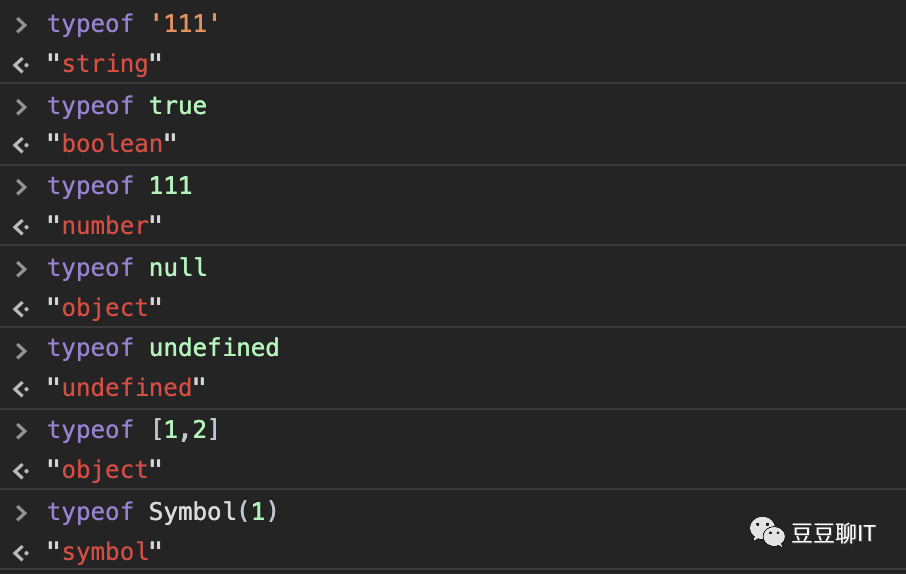
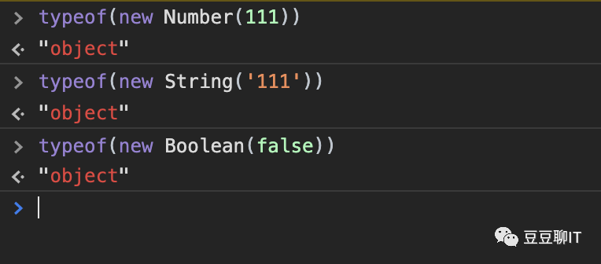
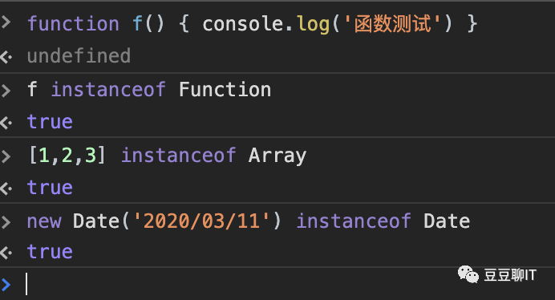
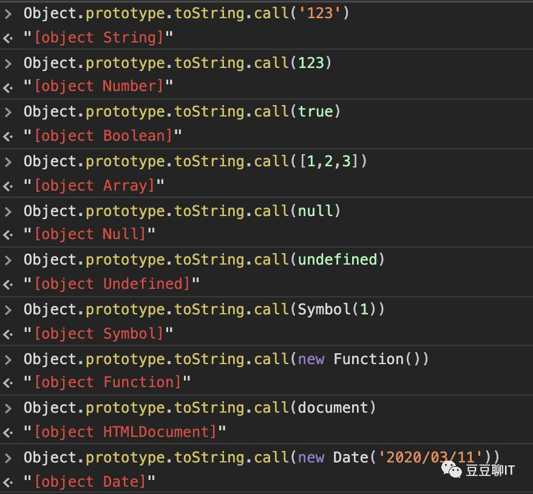
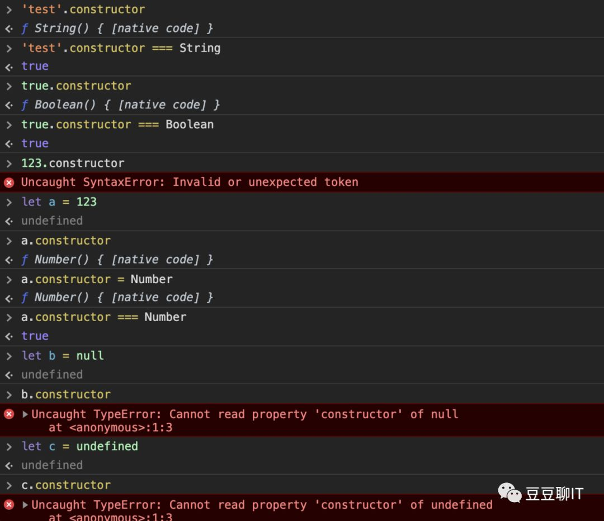

<!-- more -->
# 判断JS数据类型
 判断方法收集于网络查阅

## 1.typeof 
这个方法还是比较常用的，一般用它来判断基本数据类型，比如 String，Number，Boolean，Symbol，Object，Null，Undefined：


**这里需要特别说明一下，对于对象（引用对象）类型的判断往往并不是我们想要的结果，换句话说，就是我只知道他是对象类型，但是不知道是什么对象，比如：**

**可能大家还会比较奇怪，为什么 Null 的数据类型竟然是object，去查阅了一番，才知道这竟然是 “打小” 就是这样设计的，在JS中声明的变量在底层的表现形式都是二进制，而二进制前三位都为0的话就会被判断成object类型，而 Null 的所有机器码都是0，所以就会被当成对象来看了.**

## 2.instanceof：

**这个方法，相信写Java的童鞋并不陌生，这个方法主要是用来判断一些引用数据类型，比如 Function，Array，Date：**

**instanceof 主要就是判断一个引用实例是否属于某种类型，简单来说就是判断儿子是否属于该父亲。但是 instanceof 不仅仅是能判断父子关系，还能判断爷孙关系，甚至更多层的关系。那么它的原理是什么呢？**
```
function instanceof(left, right) {
    const rightVal = right.prototype
    const leftVal = left.__proto__
    // 若找不到就到一直循环到父类型或祖类型
    while(true) {
        if (leftVal === null) {
            return false
        }
        if (leftVal === rightVal) {
            return true
        }
        leftVal = leftVal.__proto__ // 获取祖类型的__proto__
    }
}
```
**判断原理就是只要右边变量的 prototype 在左边变量的原型链上即可，在这个判断过程中会一直遍历左边变量的原型链（父组件，祖组件）直到查找结束，如果失败就返回false**

## 3.prototype：

**完整写法是 Object.prototype.toString.call(xxx)， 就目前来看，这个方法是最好的一个方法来检测所有的数据类型，无论是基本数据类型还是引用数据类型:**

**toString方法是Object原型对象上的一个方法，默认返回调用者的具体类型，换句话说，toString运行时this指向的对象类型，返回格式为 [object xxx]，但是需要注意的是，有时候我们创建一个对象的时候可能会重写这个方法，这样就可能会导致Object的toString执行不到，所以这里需要用call方法来强制执行Object方法。**

## 4.constructor 
**constructor 在其对应对象的原型下面，自动生成，当我们写一个构造函数的时候，会自动添加一个：**
```
构造函数名.prototype.constructor = 构造函数名

function test(){ }

test.prototype.constructor = test;  // 这个是自动会生成的
```
**于是就有了：**

**图上可以看出来，Null 和 Undefined 是不能够被判断出来的，还会报错，因为 Null 和 Undefined 都是无效的对象，所以不存在 constructor 这一说。另外一点需要注意的是，constructor 属性是可以被修改的，可能会导致最后的结果不正确。**


