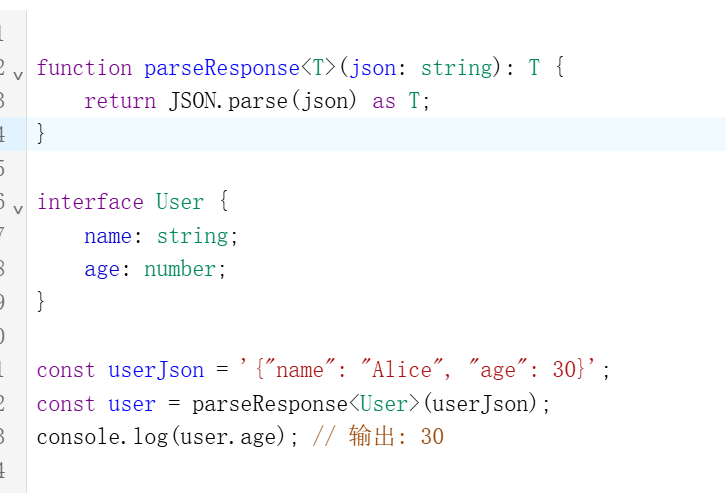

<!-- more -->
# 泛型
**1.泛型的基本概念**
泛型允许我们在定义函数、接口或类的时候，不预先指定具体的类型，而是在使用的时候再指定类型。这样我们就可以创建适用于多种类型的组件。

```
泛型函数
function identity<T>(arg: T): T {
    return arg;
}

// 使用
let output1 = identity<string>("hello"); // 显式指定T为string
let output2 = identity(42); // 类型推断，T为number

泛型接口
interface GenericIdentityFn<T> {
    (arg: T): T;
}

function identity<T>(arg: T): T {
    return arg;
}

let myIdentity: GenericIdentityFn<number> = identity;
泛型类
class GenericNumber<T> {
    zeroValue: T;
    add: (x: T, y: T) => T;
}

let myGenericNumber = new GenericNumber<number>();
myGenericNumber.zeroValue = 0;
myGenericNumber.add = (x, y) => x + y;
泛型在前端开发中的应用场景
​处理数组和集合​：
当我们不知道数组中元素的类型时，可以使用泛型来定义数组类型。
function getArray<T>(items: T[]): T[] {
    return new Array().concat(items);
}

let numArray = getArray<number>([1, 2, 3]);
let strArray = getArray<string>(["a", "b", "c"]);
​API响应处理​：
当我们从API获取数据时，可以使用泛型来定义返回的数据类型。
interface ApiResponse<T> {
    data: T;
    status: number;
    message: string;
}

function fetchData<T>(url: string): Promise<ApiResponse<T>> {
    return fetch(url).then(response => response.json());
}

// 使用
interface User {
    id: number;
    name: string;
}

fetchData<User>("/api/user/1").then(response => {
    console.log(response.data.name);
});
​状态管理（如Redux）​​：
在Redux中，我们可以使用泛型来定义action creators和reducers，使其支持不同的payload类型。
interface Action<T> {
    type: string;
    payload: T;
}

function createAction<T>(type: string, payload: T): Action<T> {
    return { type, payload };
}

const setUser = createAction<User>("SET_USER", { id: 1, name: "Alice" });
​React组件​：
在React中，我们可以使用泛型来创建可复用的组件，例如一个可以渲染任何类型列表的组件。
interface ListProps<T> {
    items: T[];
    renderItem: (item: T) => React.ReactNode;
}

function List<T>(props: ListProps<T>) {
    return (
        <div>
            {props.items.map(props.renderItem)}
        </div>
    );
}

// 使用
<List<number>
    items={[1, 2, 3]}
    renderItem={(item) => <div>{item}</div>}
/>
泛型约束
有时候我们需要限制泛型的类型范围，这时可以使用泛型约束。

interface Lengthwise {
    length: number;
}

function loggingIdentity<T extends Lengthwise>(arg: T): T {
    console.log(arg.length);
    return arg;
}

loggingIdentity("hello"); // 5
loggingIdentity([1, 2, 3]); // 3
loggingIdentity({ length: 10, value: 42 }); // 10
在React hooks中使用泛型
React的useState钩子也可以使用泛型来指定状态类型：

const [user, setUser] = useState<User | null>(null);
```


**总结**
泛型在前端开发（特别是TypeScript项目）中非常重要，它提供了以下优势：

​代码重用​：编写一次，支持多种类型
​类型安全​：在编译时捕获类型错误
​灵活性​：不丢失类型信息的前提下支持多种类型
通过合理使用泛型，我们可以构建出更加健壮、可维护的前端应用。


# 前端开发中的泛型：深度解析与实践指南
## 什么是泛型？
在前端开发中，泛型（Generics） 是 TypeScript 提供的一种强大特性，它允许我们创建可重用的组件，这些组件可以支持多种类型，而不是单一的类型。泛型增强了代码的灵活性和可重用性，同时保持了类型安全。
## 泛型的核心概念
### 1. 类型参数化
泛型通过在定义函数、接口或类时使用类型变量来实现类型参数化：
```typescript
// T 是类型变量
function identity<T>(arg: T): T {
    return arg;
}
```
### 2. 类型约束
我们可以对泛型类型进行约束，确保它们满足特定条件：
```typescript
interface Lengthwise {
    length: number;
}

function loggingIdentity<T extends Lengthwise>(arg: T): T {
    console.log(arg.length);
    return arg;
}
```
### 3. 默认类型
TypeScript 允许为泛型参数提供默认类型：
```typescript
function createArray<T = string>(length: number, value: T): T[] {
    return Array(length).fill(value);
}
```
## 泛型在前端开发中的应用场景
### 1. 状态管理（如 Redux）
```typescript
// 泛型化的 Action 类型
interface Action<T = any> {
    type: string;
    payload?: T;
}

// 使用泛型创建 reducer
function createReducer<S>(initialState: S, handlers: Handlers<S>) {
    return (state: S = initialState, action: Action) => {
        // ...
    };
}
```
### 2. API 请求处理
```typescript
// 泛型化的 API 响应类型
interface ApiResponse<T> {
    data: T;
    status: number;
    message: string;
}

// 泛型化的 fetch 函数
async function fetchData<T>(url: string): Promise<ApiResponse<T>> {
    const response = await fetch(url);
    return response.json();
}

// 使用
interface User {
    id: number;
    name: string;
}

const userResponse = await fetchData<User>('/api/user/1');
```
### 3. React 组件
```typescript
// 泛型化的列表组件
interface ListProps<T> {
    items: T[];
    renderItem: (item: T) => React.ReactNode;
}

function List<T>({ items, renderItem }: ListProps<T>) {
    return (
        <ul>
            {items.map((item, index) => (
                <li key={index}>{renderItem(item)}</li>
            ))}
        </ul>
    );
}

// 使用
const users = [{ id: 1, name: 'Alice' }, { id: 2, name: 'Bob' }];

<List
    items={users}
    renderItem={(user) => <div>{user.name}</div>}
/>
```
### 4. 表单处理
```typescript
// 泛型化的表单字段
interface FormField<T> {
    value: T;
    onChange: (value: T) => void;
    error?: string;
}

// 使用
const TextField: React.FC<FormField<string>> = ({ value, onChange, error }) => {
    return <input type="text" value={value} onChange={(e) => onChange(e.target.value)} />;
};

const CheckboxField: React.FC<FormField<boolean>> = ({ value, onChange }) => {
    return <input type="checkbox" checked={value} onChange={(e) => onChange(e.target.checked)} />;
};
```
## 泛型的高级用法
### 1. 条件类型
```typescript
type NonNullable<T> = T extends null | undefined ? never : T;

type User = {
    name: string;
    email: string | null;
};

type ValidUser = {
    name: NonNullable<User['name']>;
    email: NonNullable<User['email']>;
};
```
### 2. 映射类型
```typescript
type Readonly<T> = {
    readonly [P in keyof T]: T[P];
};

type Partial<T> = {
    [P in keyof T]?: T[P];
};

type User = {
    name: string;
    age: number;
};

type ReadonlyUser = Readonly<User>;
type PartialUser = Partial<User>;
```
### 3. 类型推断
```typescript
function getProperty<T, K extends keyof T>(obj: T, key: K) {
    return obj[key];
}

const user = { name: 'Alice', age: 30 };
const name = getProperty(user, 'name'); // string
const age = getProperty(user, 'age'); // number
```
## 泛型在前端开发中的优势
**1. 代码重用**：编写一次，支持多种类型
**2. 类型安全**：在编译时捕获类型错误
**3. 减少冗余**：避免为不同类型创建相似的代码
**4. 更好的抽象**：创建更通用的组件和函数
**5. 提高可维护性**：集中处理类型逻辑
## 实际案例：泛型表单钩子
```typescript
import { useState } from 'react';

interface FormField<T> {
    value: T;
    setValue: (value: T) => void;
    error?: string;
    setError: (error?: string) => void;
}

function useFormField<T>(initialValue: T): FormField<T> {
    const [value, setValue] = useState<T>(initialValue);
    const [error, setError] = useState<string | undefined>();
    
    return {
        value,
        setValue,
        error,
        setError
    };
}

// 使用
const nameField = useFormField<string>(''); // 字符串字段
const ageField = useFormField<number>(0);    // 数字字段
const isAdminField = useFormField<boolean>(false); // 布尔字段
```
## 泛型最佳实践
**1. 使用有意义的类型变量名：**
    - T 表示类型
    - K 表示键
    - V 表示值
    - E 表示元素
**2. 避免过度泛型化**：只在需要灵活性的地方使用泛型
**3. 合理使用约束**：确保泛型类型满足必要的要求
**4. 提供默认类型**：为常见用例提供合理的默认值
**5. 文档注释**：为泛型组件和函数添加详细注释
## 常见错误与解决方案
### 错误：类型参数过多
```typescript
// 过于复杂的泛型
function complexFunction<T, U, V, W>(a: T, b: U, c: V, d: W) {
    // ...
}
```
解决方案：重构为多个函数或使用对象参数
### 错误：忽略类型约束
```typescript
function getLength<T>(arg: T): number {
    return arg.length; // 错误：T 可能没有 length 属性
}
```
解决方案：添加类型约束
```typescript
function getLength<T extends { length: number }>(arg: T): number {
    return arg.length;
}
```
## 总结
泛型是 TypeScript 在前端开发中最强大的特性之一，它允许我们创建灵活、可重用且类型安全的代码。通过合理使用泛型，我们可以：
1.构建更通用的组件和函数
2. 减少代码重复
3. 提高类型安全性
4. 增强代码的可维护性
5. 创建更健壮的前端架构
掌握泛型的使用，将显著提升你的 TypeScript 技能和前端开发能力，使你能够构建更复杂、更健壮的应用程序。