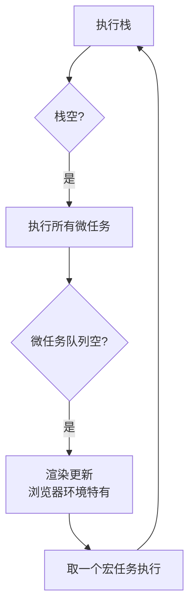
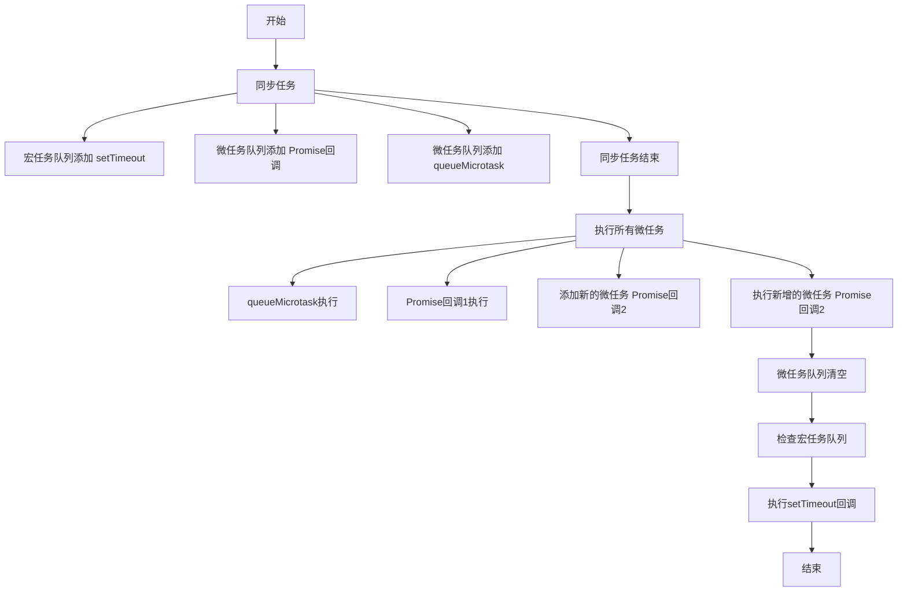

<!-- more -->
::: info
 事件循环机制中 **微任务和宏任务** 的差异主要由 **执行机制和设计目标** 决定：

**1.微任务设计初衷**
微任务设计初衷是为解决特定场景需求，例如Promise的回调执行、process.nextTick()等，这些任务通常需要快速完成且不影响其他异步操作，因此采用单队列处理模式。 ‌

**2.宏任务特性**
宏任务涉及更复杂的操作（如定时器、文件读写、UI渲染等），需要更灵活的调度机制。浏览器或环境会为不同类型宏任务维护独立队列，例如定时器队列、I/O操作队列等，但执行时仍遵循先进先出原则。 ‌

**3.执行优先级差异**
微任务优先级高于宏任务，每次宏任务执行后都会优先处理所有微任务，确保异步操作不会阻塞主线程。这种设计既保证响应性又维持任务处理的独立性
:::
<!-- more -->
# 微任务与宏任务
在JavaScript异步编程中，微任务（Microtasks）和宏任务（Macrotasks） 是两种不同优先级的任务队列，共同构成了事件循环（Event Loop）的核心机制。理解它们的区别对掌握异步执行顺序至关重要。

宏任务和微任务都是JavaScript异步任务中的概念。它们都是指那些会在将来某个时刻执行的代码。区别在于执行时机和优先级。

**微任务（Microtask） 是JavaScript引擎自身产生的任务，优先级更高。** 在当前任务（也就是执行栈）结束后，JavaScript引擎会立即处理所有微任务队列中的任务，清空微任务队列后才会执行浏览器渲染或处理下一个宏任务。常见的微任务包括：Promise的回调函数（then/catch/finally）、MutationObserver（监测DOM变化的接口）以及queueMicrotask API添加的任务。

**宏任务（Macrotask）则是由宿主环境（浏览器或Node.js）发起的任务，优先级相对较低。** 包括setTimeout、setInterval的回调、I/O操作（如文件读写、网络请求）、UI渲染（浏览器）、setImmediate（Node.js）、requestAnimationFrame（浏览器）等。事件循环的每一轮（称为一次tick），只会执行一个宏任务，然后就去处理所有的微任务。

**​为什么微任务优先级更高？​​**
微任务为JavaScript引擎内部任务，需要在渲染更新前完成所有状态变更。

**总结关键点：**

- 微任务由JS引擎管理，宏任务由宿主环境管理。
- 每个事件循环中，总是先执行当前执行栈中的同步代码。
- 接着执行所有微任务（清空微任务队列）。
- 然后进行渲染（浏览器环境下），之后取一个宏任务执行。
- 宏任务执行后再次执行所有微任务，依此循环。
这种机制保证了微任务可以尽快执行，而宏任务则按顺序一个接一个地执行（在每个宏任务之间，引擎都去处理微任务和可能的渲染）

### 一、微任务（Microtasks）
定义：
由JavaScript引擎自身调度的高优先级任务，必须在浏览器渲染前完全执行完毕。
典型来源：
1. Promise回调
```javascript
Promise.resolve().then(() => {
  console.log('微任务 - Promise回调');
});
```
1. queueMicrotask()
```javascript
queueMicrotask(() => console.log('微任务 - queueMicrotask'));
```
1. MutationObserver（监听DOM变化）
```javascript
new MutationObserver(() => console.log('DOM改变了')).observe(...);
```
1. Node.js环境特有
process.nextTick()（Node.js中优先级最高）
核心特性：
✅ 插队执行：在前一个宏任务结束、下一个宏任务开始前必须清空所有微任务
✅ 高优先级：阻塞浏览器渲染（如执行100个微任务时页面会卡住）
✅ 单队列：整个事件循环只有一个微任务队列
---


### 二、宏任务（Macrotasks）
定义：
由宿主环境（浏览器/Node.js）管理的常规异步任务，每次事件循环只执行一个。
典型来源：
1. 定时器相关
```javascript
setTimeout(() => console.log('宏任务 - setTimeout'), 0);
setInterval(() => console.log('宏任务 - setInterval'), 100);
```
1. I/O操作
```javascript
fetch('/data').then(res => console.log('宏任务 - 网络请求完成'));
```
1. UI渲染（浏览器特有）
```javascript
requestAnimationFrame(() => console.log('宏任务 - 渲染回调'));
```
1. 脚本执行
```html
<script>console.log('宏任务 - 脚本执行')</script>
```
1. 事件回调
```javascript
button.addEventListener('click', () => console.log('宏任务 - 点击事件'));
```
1. Node.js环境特有
setImmediate()（比setTimeout(fn,0)优先级更高）
核心特性：
⏳ 排队执行：事件循环每轮只执行一个宏任务
🚦 低优先级：执行后会让出控制权给微任务队列
📚 多队列：存在不同的宏任务队列（如定时器队列、网络请求队列等）
---

### 三、执行流程演示
```javascript
console.log('同步任务开始');

// 宏任务
setTimeout(() => console.log('宏任务 - setTimeout'), 0);

// 微任务
Promise.resolve().then(() => console.log('微任务 - Promise'));

console.log('同步任务结束');
```
#### 执行顺序解析：
1. 同步任务开始 → 同步任务最先执行
1. 同步任务结束 → 继续执行同步代码
1. 微任务 - Promise → 所有微任务必须立刻执行
1. 宏任务 - setTimeout → 最后执行宏任务
#### 输出顺序：
```
同步任务开始
同步任务结束
微任务 - Promise
宏任务 - setTimeout
```
---

### 四、事件循环中的执行模型

#### 关键规则：
1. 微任务优先：每执行完一个宏任务后，必须清空整个微任务队列
1. 微任务会创建微任务：微任务执行过程中再添加的新微任务会被继续执行，导致死循环风险
```javascript
function infiniteMicrotask() {
  Promise.resolve().then(infiniteMicrotask); // 页面卡死！
}
```
1. 宏任务分级：不同宏任务类型有优先级差异（如setImmediate > setTimeout）
---

### 五、实际应用场景对比
|场景|推荐使用|原因|
|---|---|--|
|异步状态更新|微任务|在渲染前完成DOM状态变更（如Vue.nextTick）|
|批量数据处理|微任务|避免中间状态被渲染|
|耗时操作（如大数组处理）|宏任务|用setTimeout(fn,0)分片执行避免阻塞|
|动画处理|宏任务 + requestAnimationFrame|保持与浏览器刷新率同步|
|高精度定时|微任务 + 递归|通过微任务链实现比4ms更精确的调度（特殊场景）|

> 💡 核心记忆点：
微任务如VIP通道（插队执行），宏任务如普通队列（按序等候）。当一段同步代码结束，JS引擎会立刻处理所有微任务（清空队列），然后才执行下一个宏任务或渲染页面。


## 宏任务与微任务的区别
我们要解释宏任务（macrotask）和微任务（microtask）的区别。这是JavaScript事件循环中的两个重要概念。
**宏任务包括：** script（整体代码）、setTimeout、setInterval、I/O操作、UI渲染、setImmediate（Node.js环境）等。
**微任务包括：** Promise回调、MutationObserver、process.nextTick（Node.js环境）等。
**关键区别在于事件循环的处理方式：**

1.事件循环中，每次执行一个宏任务（从宏任务队列中取出一个任务执行）。
2.在该宏任务执行完毕后，会立即执行当前微任务队列中的所有微任务（直到微任务队列为空）。
3.然后进行UI渲染（如果需要），接着再取下一个宏任务执行。

因此，微任务会在下一个宏任务之前执行，也就是说微任务有更高的优先级。

示例代码：
```
console.log('1');
setTimeout(() => { console.log('2'); }, 0);
Promise.resolve().then(() => { console.log('3'); });
console.log('4');
输出顺序是：1, 4, 3, 2
解释：

首先，整个script作为一个宏任务执行，输出1和4。
然后，执行当前宏任务中的微任务（Promise回调），输出3。
接着，下一个宏任务（setTimeout）执行，输出2。

另一个更复杂的例子：
console.log('1');
setTimeout(function() {
console.log('2');
new Promise(function(resolve) {
console.log('3');
resolve();
}).then(function() {
console.log('4');
});
}, 0);
new Promise(function(resolve) {
console.log('5');
resolve();
}).then(function() {
console.log('6');
});
console.log('7');
```
输出顺序：1, 5, 7, 6, 2, 3, 4
解释：

第一个宏任务（整体代码）：
console.log('1')  => 1
遇到setTimeout，将其回调加入宏任务队列。
执行Promise的构造函数，输出5，并将then的回调加入微任务队列。
console.log('7')  => 7
然后执行微任务队列：输出6。
下一个宏任务（setTimeout的回调）：
console.log('2') => 2
执行Promise构造函数，输出3，并将then的回调加入微任务队列。
然后执行微任务队列（当前宏任务执行完毕后）：输出4。

因此，顺序是1,5,7,6,2,3,4。
**总结：**
**宏任务：** 由宿主（浏览器、Node）发起的任务，如事件回调、网络请求完成回调、定时器等。
**微任务：** 由JavaScript自身发起的任务，如Promise、MutationObserver等，通常用于异步操作，且优先级高于宏任务。
注意：在同一个事件循环中，微任务总是在下一个宏任务之前执行完毕。

# JavaScript事件循环机制：宏任务与微任务详解
## 宏任务（Macrotasks）与微任务（Microtasks）的区别
|特性|宏任务 (Macrotask)|微任务 (Microtask)|
|--|--|--|
|定义|JavaScript引擎外部的任务|JavaScript引擎内部的任务|
|执行时机|每个事件循环轮次中执行一次|在每个宏任务执行后立即执行|
|优先级|较低|较高（插队执行）|
|包含任务类型|setTimeout, setInterval, I/O操作, UI渲染, setImmediate(Node), requestAnimationFrame|Promise回调, MutationObserver, process.nextTick(Node), queueMicrotask|
|任务队列|一个事件循环可以有多个宏任务队列（如计时器队列、I/O队列等）|一个事件循环只有一个微任务队列|
|运行机制|"尽最大努力"按添加顺序执行|必须完全清空队列才会继续|
|代码控制|需要宿主环境API|可直接在JavaScript中创建|

## 理解事件循环（Event Loop）机制
JavaScript的事件循环机制遵循以下基本流程：
1.执行当前调用栈中的所有同步代码
2.执行当前微任务队列中的所有任务（直到队列清空）
3.执行浏览器渲染更新（如果需要）
4.从宏任务队列中取出一个任务执行
5.重复步骤1-4
## 代码示例分析
```javascript
console.log('1. 同步任务 - 开始');

setTimeout(() => {
  console.log('6. 宏任务 - setTimeout回调');
}, 0);

Promise.resolve()
  .then(() => {
    console.log('4. 微任务 - Promise回调1');
    return Promise.resolve();
  })
  .then(() => {
    console.log('5. 微任务 - Promise回调2');
  });

queueMicrotask(() => {
  console.log('3. 微任务 - queueMicrotask');
});

console.log('2. 同步任务 - 结束');
```
### 输出顺序分析：
**1.同步任务 - 开始** (第一个同步输出)
**2.同步任务 - 结束** (最后一个同步输出)
**3.微任务 - queueMicrotask** (微任务队列中先添加)
**4.微任务 - Promise回调1** (微任务队列中后添加)
**5.微任务 - Promise回调2** (微任务队列中添加)
**6.宏任务 - setTimeout回调** (宏任务队列中的任务)

## 实际应用场景
### 宏任务应用场景：
(1) 延迟执行代码（setTimeout, setInterval)
(2) 大量数据分批处理（分时处理）
(3) 非关键UI更新
(4) 跨文档通信
### 微任务应用场景：
(1) Promise异步流程控制
(2) DOM更新后的响应（MutationObserver)
(3) 在渲染前完成必要操作
(4) 保证操作顺序的原子性
## 常见问题
**1. 为什么微任务优先级更高？**
微任务为JavaScript引擎内部任务，需要在渲染更新前完成所有状态变更。
**2. 多个微任务会阻塞页面渲染吗？**
长时间运行的微任务会阻塞渲染，应避免在微任务中进行大量计算。
**3. 如何手动创建宏任务/微任务？**
```javascript
// 宏任务
setTimeout(() => {}, 0);
// 微任务
Promise.resolve().then(() => {});
queueMicrotask(() => {});
```
**4.Node.js环境有何不同？**
Node.js中，process.nextTick优先级最高，其次是微任务，然后是宏任务。
## 最佳实践建议
**1.将耗时操作放入宏任务** 以避免阻塞渲染
**2.关键状态更新使用微任务** 确保一致性
**3.避免在微任务中处理过多任务** 防止阻塞
**4.使用queueMicrotask替代多层Promise** 提高代码可读性
**5.复杂操作使用宏任务分时执行** 保持页面流畅性
理解宏任务和微任务的机制对于编写高效、无阻塞的JavaScript代码至关重要，尤其是在处理复杂异步逻辑时，合理的任务分配可以显著提升应用性能。


## 为什么事件循环机制微任务只有一个，宏任务可以多个？
我们讨论的是JavaScript中的事件循环（Event Loop）机制。事件循环负责处理异步任务，并将它们分为宏任务（macrotasks）和微任务（microtasks）。为了理解为什么微任务队列只有一个而宏任务队列可以有多个，我们需要回顾一下事件循环的基本原理。

**事件循环的工作流程如下：**

- 执行一个宏任务（例如：script整体代码、setTimeout、setInterval、setImmediate、I/O操作、UI渲染等）。
- 执行过程中如果遇到微任务（如Promise的then/catch/finally、process.nextTick、MutationObserver等），则将它们添加到微任务队列中。
- 当前宏任务执行完毕后，立即依次执行微任务队列中的所有微任务（直到微任务队列清空）。
- 进行必要的UI渲染（如果有的话）。
- 然后从宏任务队列中取出下一个宏任务执行，如此循环。

**关键点：**
1. 每个事件循环（Event Loop）只有一个微任务队列（microtask queue）。在一个宏任务执行完毕后，会清空整个微任务队列。这是因为微任务是在当前执行栈结束后立刻执行的任务，它们应该被尽快地、连续地执行，而不应该被打断（除非又产生了新的微任务，但也会在当前循环中被清空）。

2. 而宏任务队列（macrotask queue）则可以有多个。这是因为宏任务来源不同，不同的宏任务会被分配到不同的宏任务队列中。例如：
- setTimeout的回调会被放入“定时器”宏任务队列。
- DOM事件回调会被放入“交互”宏任务队列。
- 网络请求（fetch）的回调会被放入“网络”宏任务队列。
- 等等。
事件循环会按照一定的顺序（由规范定义）从不同的宏任务队列中选择一个队列，然后从该队列中取出最老的宏任务执行。常见的宏任务队列包括：定时器队列、I/O事件队列、检查队列（setImmediate）、关闭事件的回调队列等。

**为什么这样设计？**

1. 微任务的设计目的是在宏任务执行完成后，渲染之前，执行一些高优先级的任务。因此，它们需要立即执行，不能被延迟。所以设计为一个队列，并且在该阶段一次性全部执行完毕。

2. 宏任务的设计则允许我们将不同来源的任务分类，以便事件循环可以按优先级顺序处理它们（例如，用户交互的任务可能比定时器任务更重要，所以可能会被优先处理）。这样也使得事件循环能够更有效地管理不同来源的异步任务。

**总结：**

- 微任务队列只有一个，因为微任务需要在当前宏任务结束后立即执行，并且在执行微任务时如果产生了新的微任务，会继续在同一个队列中执行直到清空，这是为了确保微任务的高优先级和连续性。

- 宏任务队列有多个，因为事件循环需要管理来自不同任务源的宏任务，并按照规定的顺序（如先处理交互事件再处理定时器）来执行。

::: info
注意：虽然我们常说有多个宏任务队列，但具体到事件循环中，它实际上是按照一定的顺序从多个宏任务队列中挑选任务。例如，在浏览器环境中，事件循环可能会优先处理用户输入事件，然后再处理网络事件，再然后是定时器事件等。
:::


在事件循环（Event Loop）机制中，**微任务队列（Microtask Queue）只有一个，而宏任务队列（Macrotask Queue）可能有多个。** 这是由设计目标和优先级差异决定的：

### 1. 微任务的设计目标：高优先级与连续性
**1.单队列实现即时执行：**
微任务（如 Promise.then、MutationObserver、queueMicrotask）必须在当前宏任务结束之后、下一个宏任务开始之前立即执行，且不能中断。如果存在多个微任务队列，可能无法保证这种连续的执行顺序，导致优先级混乱。
**2.避免渲染阻塞：**
浏览器在重新渲染前必须清空微任务队列。单队列确保了所有微任务都在渲染前完成，避免渲染延迟（如更新 DOM 后需立刻执行回调）。

### 2. 宏任务的设计目标：任务来源多样化
**1.多队列管理不同来源：**
宏任务（如 setTimeout、DOM 事件、I/O 回调）来源多样（定时器、用户交互、网络请求等）。不同来源的宏任务需要分队列管理，以控制执行顺序（例如优先处理用户点击而非定时器）。
**2.与浏览器调度机制匹配：**
浏览器通过多个宏任务队列实现调度优化（如 requestAnimationFrame 在渲染前执行，用户输入事件优先于脚本执行）。

### 3. 执行流程的差异
**1.微任务队列：**
当 JS 调用栈清空时，事件循环会一次性清空整个微任务队列（包括执行中新产生的微任务）。单队列可避免执行一半被其他宏任务插入。
**2.宏任务队列：**
事件循环按优先级规则（如浏览器定义的顺序）从多个宏任务队列中取出一个任务执行，执行后可能再次检查微任务队列。

### 4. 简单记忆
```text
┌───────────────────┐
│   宏任务（如点击事件）  │ → 执行 → 清空微任务队列 → 渲染（可选）
└───────────────────┘
↑          ↓
│     ┌───────────┐
│     │ 微任务队列   │ ← 微任务优先级最高
│     └───────────┘
└─ 多个宏任务队列等待调度
```

### 总结
**1.微任务单队列：** 确保高优先级任务的连续执行，不被打断。
**2.宏任务多队列：** 适应不同任务源的调度需求（如用户交互、网络响应）。
这种设计平衡了效率（微任务快速响应）与灵活性（宏任务按来源分组），避免低优先级宏任务阻塞关键微任务。