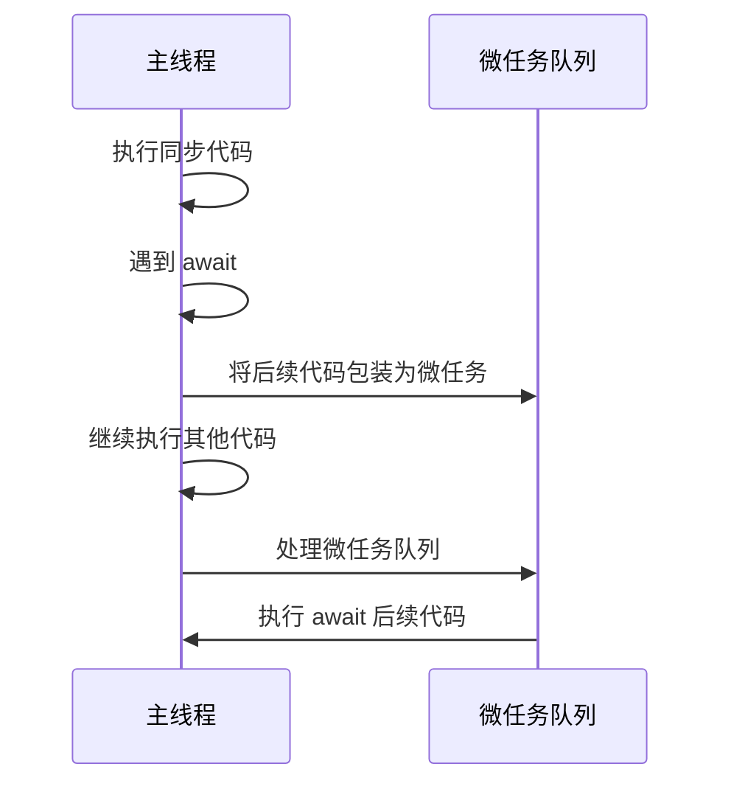

<!-- more -->
# async/await 的异步特性解析
async/await 是 JavaScript 中处理异步操作的核心机制，它本质上是一种异步编程模型。让我详细解释其异步特性：
## async/await 的异步本质
### 1. 非阻塞执行
async/await 不会阻塞主线程：
- 当遇到 await 表达式时，函数会暂停执行
- 控制权立即返回给调用者
- 主线程可以继续执行其他任务
```javascript
async function example() {
    console.log('开始');
    await fetchData(); // 不会阻塞主线程
    console.log('结束');
}

console.log('主线程继续');
example();
console.log('主线程完成');
```
### 2. 基于 Promise 的语法糖
async/await 本质上是 Promise 的语法糖：
- async 函数总是返回一个 Promise
- await 后面可以跟任何 Promise 对象
- 它让基于 Promise 的代码更易读
```javascript
// 等效的 Promise 和 async/await 代码
function promiseVersion() {
    return fetchData()
        .then(data => processData(data))
        .then(result => saveResult(result));
}

async function asyncVersion() {
    const data = await fetchData();
    const result = await processData(data);
    return saveResult(result);
}
```
### 3. 事件循环中的位置
在 JavaScript 事件循环中：
- await 表达式将后续代码包装为微任务
- 当 Promise 解决后，微任务被加入队列
- 在当前宏任务结束后执行所有微任务

## 为什么 async/await 是异步的
### 1. 不阻塞主线程
- 长时间运行的操作（如网络请求）不会冻结 UI
- 主线程保持响应，可以处理用户交互
- 适合 I/O 密集型操作
### 2. 顺序执行异步操作
- 让异步代码看起来像同步代码
- 保持代码顺序性和可读性
- 避免回调地狱（callback hell）
### 3. 错误处理机制
- 使用 try/catch 处理异步错误
- 比 Promise 的链式 .catch() 更直观
```javascript
async function fetchDataWithRetry() {
    try {
        const data = await fetch('https://api.example.com/data');
        return data.json();
    } catch (error) {
        console.error('请求失败:', error);
        // 重试逻辑
        return fetchDataWithRetry();
    }
}
```
## 实际应用场景
### 1. 网络请求
```javascript
async function getUserData(userId) {
    const response = await fetch(`/api/users/${userId}`);
    const data = await response.json();
    return data;
}
```
### 2. 文件操作
```javascript
async function readFile(path) {
    const content = await fs.promises.readFile(path, 'utf-8');
    return content;
}
```
### 3. 多步操作
```javascript
async function checkoutProcess() {
    const cart = await getCart();
    const shipping = await calculateShipping(cart);
    const payment = await processPayment(cart.total + shipping);
    await sendConfirmation(payment);
}
```
## 关键特性总结
|特性|说明|
|---|---|
|非阻塞|不阻塞主线程，保持UI响应|
|基于Promise|本质是Promise的语法糖|
|顺序执行|让异步代码具有同步代码的可读性|
|错误处理|使用try/catch捕获异步错误|
|微任务机制|利用事件循环的微任务队列|

            
           
async/await 是 JavaScript 异步编程的现代解决方案，它通过语法糖的形式让开发者能够以更直观、更易读的方式编写异步代码，同时保持了非阻塞的特性。