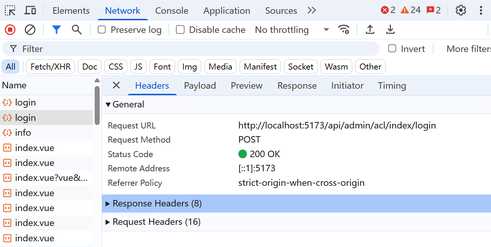
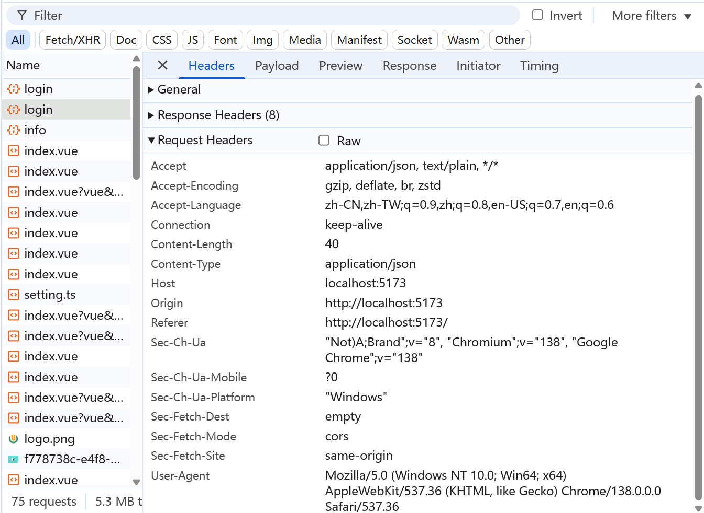
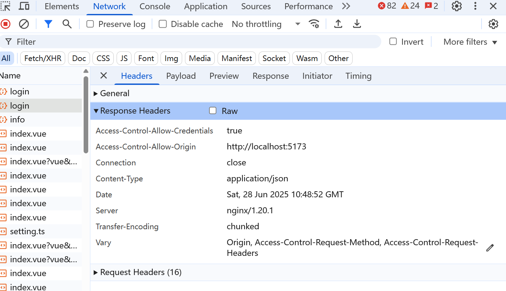

<!-- more -->
# DOM简介
```
DOM 全名称 document object model 文档对象模型；
JS中通过DOM 来操作HTML ，只要理解dom 就可以随心所欲操作web 页面。
--文档
  文档表示的就是整个HTML网页文档；
--对象
将网页中的每一个部分都转换成一个对象
--模型
使用模型来表示对象之间的关系，方便获取对象，通俗说，模型就是dom树，关联节点。

```
# 节点
```
节点Node，是构成我们网页的最基本部分，网页中的每一个部分都可以成为一个节点。
比如：属性、文本、注释、整个文档等都是一个节点，每个节点的类型不一样，有元素节点，属性节点、文本节点、文档节点等。
```

## http三次握手
<HttpConnection />

**一句话总结:​** 三次握手就是通信双方互喊 👉 ​​“在吗？”​​ → ​​“在的，你听得到吗？”​​ → ​​“听得到，开始传输吧！”​​
少一次可能“对牛弹琴”，多一次浪费资源，三次是工程最优解！
## http 四次挥手
<HttpClose />

## 浏览器请求数据的过程
**1.请求报文**：请求行+请求头+空行+请求体
**2.响应报文**：响应行+响应头+响应体

## 概括
**1.浏览网页时按下回车电脑就会发送一个【请求报文】服务器处理完毕会发送一个【响应报文】**
**2.发送 【请求报文】**
**3.处理浏览器请求**
**4.将处理结果返回给浏览器**
**5.发送【响应报文】**
**6.解析浏览器返回的内容呈现给用户**

## 什么是URL
URL格式:http://127.0.0.1/index.html (浏览器会自动添加:80) http://127.0.0.1:80/index.html (完整的格式)

URL拆分
http:// URL协议类型
127.0.0.1服务器IP地址:80服务器的端口号
index.html需要访问的资源名称

URL拆分后每个部分的作用

IP地址和端口号： 所以服务器ip地址和端口好的作用就是告诉浏览器我们需要访问的那台服务器的详细地址是什么

index.htmI作用:当我们通过IP地址和端口号找到对应的服务器之后，需要通过资源名称告诉服务器，我们需要获取服务器上的哪个资源

## 什么是http协议
<ul><li>HTTP是Hypertext Transter Prolocol(超文本传输协议)的缩写</li><li>什么是协议？</li><li>在现实生活中有很多的协议，例如租房协议买卖协议/离婚协议 .无论是什么协议他们都是一 个共同点，就是用来规范约束某一类事物</li><li>HTTP协议是用来规范/约束哪一 类事物?</li><li>HTTP协议就相当于我们让两个人都说中文或者都说英文一样，就是提前规范两个人之间如何沟通，也就是规范约束浏览器和服务器之间如何沟通</li></ul>

##### general基本信息



**Remote Address（远程地址）**:**就是http请求的地址或者源地址（可以把 ​Remote Address​ 想象成 ​快递发货地址）**

**Referrer Policy（来源策略）**:是 **​控制浏览器在跳转时是否告诉新页面“你从哪里来”的隐私开关。** Referer头部信息通常包含链接的来源地址，例如从一个页面跳转到另一个页面时，目标服务器会收到这个信息。Referrer Policy 通过定义不同的策略值，可以限制或调整在请求过程中向目标服务器传递来源页面信息的细节程度，从而平衡用户隐私保护与网站功能实现之间的矛盾‌。

**access-control-allow-origin**：在跨域请求中，服务器用来指定允许访问资源的
<p><strong>Access-Control-Allow-Credentials</strong>：指明<strong>是否允许</strong>客户端在跨域请求中<strong>携带 Cookie</strong> 等凭证信息。</p>

<p><strong>Cache-Control</strong>：客户端用来告知服务器或缓存代理它希望<strong>如何控制缓存</strong>行为（<strong><code>no-cache</code>、<code>no-store</code>、<code>max-age=0</code></strong>）。</p>


##### ReqestHeaders请求头

##### ResponseHeaders响应头


<HttpFiled />

## 响应码
<table><thead><tr><th>状态码</th><th>类型</th><th>描述</th></tr></thead><tbody><tr><td><strong>200 OK</strong></td><td>2xx 成功</td><td>请求成功，并返回所请求的数据。</td></tr><tr><td><strong>201 Created</strong></td><td>2xx 成功</td><td>请求成功且<strong>服务器创建了新的资源</strong>（常用于 POST 请求）。</td></tr><tr><td><strong>204 No Content</strong></td><td>2xx 成功</td><td>请求成功，但<strong>没有返回任何内容</strong>，常见于删除或更新操作后。</td></tr><tr><td><strong>301 Moved Permanently</strong></td><td>3xx 重定向</td><td><strong>资源</strong>已被<strong>永久</strong>移动到<strong>新 URL</strong>，客户端和搜索引擎将<strong>更新访问链接</strong>。</td></tr><tr><td><strong>302 Found</strong></td><td>3xx 重定向</td><td>请求的资源<strong>临时</strong>位于其他 URL，服务器提示继续使用<strong>原 URL 访问</strong>。</td></tr><tr><td><strong>304 Not Modified</strong></td><td>3xx 重定向</td><td><strong>缓存内容未修改</strong>，无须重新传输数据。</td></tr><tr><td><strong>400 Bad Request</strong></td><td>4xx 客户端错误</td><td><strong>请求格式错误</strong>或<strong>缺少必需参数</strong>，服务器无法理解请求。</td></tr><tr><td><strong>401 Unauthorized</strong></td><td>4xx 客户端错误</td><td>请求<strong>未经授权</strong>，需要提供有效的身份验证凭证。</td></tr><tr><td><strong>403 Forbidden</strong></td><td>4xx 客户端错误</td><td>服务器理解请求但<strong>拒绝执行</strong>，可能由于<strong>权限限制</strong>。</td></tr><tr><td><strong>404 Not Found</strong></td><td>4xx 客户端错误</td><td>请求的<strong>资源不存在</strong>，常见于错误链接或资源被删除的场景。</td></tr><tr><td><strong>405 Method Not Allowed</strong></td><td>4xx 客户端错误</td><td><strong>请求方法不被允许</strong>，例如用 GET 访问只允许 POST 的接口。</td></tr><tr><td><strong>500 Internal Server Error</strong></td><td>5xx 服务器错误</td><td><strong>服务器内部出现错误</strong>，无法完成请求。</td></tr><tr><td><strong>502 Bad Gateway</strong></td><td>5xx 服务器错误</td><td><strong>网关或代理服务器</strong>从上游服务器<strong>接收到无效响应</strong>。</td></tr><tr><td><strong>503 Service Unavailable</strong></td><td>5xx 服务器错误</td><td>服务器<strong>当前无法处理</strong>请求，可能由于过载或正在维护中。</td></tr><tr><td><strong>504 Gateway Timeout</strong></td><td>5xx 服务器错误</td><td>作为<strong>网关或代理服务器</strong>时，<strong>未及时</strong>从上游服务器<strong>获得响应</strong>。</td></tr></tbody></table>

# 浏览器加载原理

**浏览器的加载原理‌**主要包括以下几个步骤：
**1.‌ 用户输入网址‌**：用户在浏览器地址栏输入网址（如 https://www.example.com）并按下回车键，这是浏览器工作的起点‌。

**2.‌ DNS解析‌**：浏览器将用户输入的域名（如 www.example.com）转换为服务器IP地址。这个过程包括检查本地缓存、向本地DNS服务器发送解析请求，然后向上级DNS服务器递归查询，最终由权威DNS服务器返回IP地址‌。

**3.‌ 建立网络连接‌**：浏览器获取到目标服务器的IP地址后，通过TCP协议建立一个连接。TCP连接的建立过程包括三次握手：SYN、SYN-ACK和ACK‌


**4.‌ 发送HTTP请求‌**：TCP连接建立后，浏览器通过HTTP协议向服务器发送请求，获取网页内容‌。


**5.‌ 查找缓存‌**：在真正发起网络请求之前，浏览器会先在数据存储中查询是否有需要请求的文件缓存。如果没有缓存，则进入网络请求过程；如果有缓存，则直接返回缓存内容‌。

**6.‌ 解析HTML‌8**：浏览器接收到HTML代码后，解析HTML代码生成DOM树和CSSOM树。在这个过程中，浏览器会启动一个预解析器率先下载和解析CSS，遇到JS时会暂停其他操作，等待JS下载和执行后再继续‌。

**7.‌ 样式计算和布局‌**：浏览器将DOM树和CSSOM树对应起来，进行样式计算和布局，生成布局树。布局树包含了之后渲染后呈现给用户的所有信息‌。

**8.‌ 分层渲染‌**：为了优化渲染性能，渲染树会被分解成多个层（Layers），每个层可以独立于其他层进行渲染和合成，减少绘制和合成的工作量‌。

**9.‌ 呈现页面‌**：最后，浏览器将布局树转换为可视化的页面，呈现给用户‌。

通过这些步骤，浏览器能够高效地加载和渲染网页内容，提供流畅的浏览体验。


# 浏览器渲染原理及流程
**浏览器渲染流程是将HTML、CSS和JavaScript转换为可视化页面的核心过程，主要包含解析、样式计算、布局、分层、绘制与合成六大阶段‌。** 现代浏览器采用多进程架构（如Chrome的独立渲染进程）提升性能与稳定性。

### 核心渲染流程

### 1.‌解析与构建‌

  **DOM树生成‌**：主线程逐行解析HTML，生成DOM树结构。遇到`<script>标签时暂停解析，优先执行JS（异步脚本除外）`。‌‌

  **CSSOM树构建‌**：预解析线程提前下载CSS文件，主线程解析后生成CSSOM树，与DOM树共同构成渲染树基础.

  ### 2.样式计算与布局‌

  ‌**计算样式‌**：将DOM节点与CSSOM规则匹配，解析相对单位（如em→px）和预设值（如red→rgb(255,0,0)），生成带最终样式的DOM树。‌‌
  
  **‌布局树生成‌**：根据样式计算元素几何信息（位置、尺寸），生成布局树。DOM树与布局树内容不完全对应（如display:none元素不进入布局树）。

  ### 3.分层与绘制

  **分层优化‌**：根据堆叠上下文属性（如z-index、transform）将页面分为多个图层，单独渲染以提升效率。‌‌

  **‌绘制指令生成‌**：主线程将图层拆分为绘制指令（类似Canvas绘图命令），传递给合成线程处理。

  ### 4.合成与显示
  **分块光栅化‌**：合成线程将图层分割为图块，优先处理可视区域内容，利用GPU加速生成位图。‌‌
  ‌**最终合成‌**：所有图块光栅化后，合成线程通过IPC提交给浏览器进程，最终由GPU驱动显示器更新。


  ### 关键性能影响因素
  **1.‌回流（重排）与重绘‌**：

  **回流‌**：布局变化（如窗口缩放、元素尺寸改动）触发重新计算布局树，代价最高。‌‌

  **重绘‌**：颜色等不影响布局的样式修改仅触发重新生成绘制指令，跳过布局阶段。
 
 **2. 优化策略**
 |优化方向	|具体方法	|原理|
 | :-------| ----- | :-----: |
 |减少回流|	使用transform替代top/left动画	|跳过布局阶段，直接进入合成‌‌|
|分层控制|	为频繁变动元素添加will-change: transform |提前分配独立图层，避免临时分层计算|‌‌
 |JS优化	|避免同步布局操作（如读取offsetWidth后立即修改样式）|	防止强制布局计算阻塞渲染线程‌‌|


