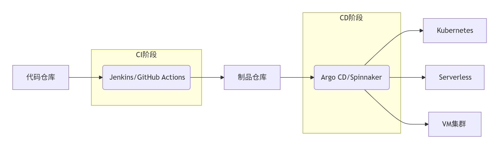

<!-- more -->
# ‌CI/CD‌概念
<cicd></cicd>

## 持续部署CD有哪些工具

持续部署（CD）工具列表涵盖开源和商业解决方案，以下按类别整理主流工具：
**​开源工具**​
1.​Jenkins​

最流行的开源CI/CD工具之一，插件生态系统丰富
特点：基于Java开发，支持Pipeline即代码，可通过Jenkinsfile配置流程
适用场景：复杂的定制化部署流程

2.​GitLab CI/CD​

GitLab内置的CI/CD解决方案，与GitLab仓库无缝集成
特点：使用.gitlab-ci.yml配置文件，支持Auto DevOps功能
部署示例：自动部署到Kubernetes、云服务器等

3.​GitHub Actions​

GitHub原生提供的自动化工具，直接集成在仓库中
特点：通过YAML文件定义工作流，市场提供丰富的预置Action
典型用途：构建测试后自动部署到AWS/Azure/Cloudflare等

4.​Argo CD​

专为Kubernetes设计的GitOps持续交付工具
特点：声明式部署，自动同步Git仓库与K8s集群状态
核心优势：可视化应用状态，支持多环境管理

5.​Spinnaker​

Netflix开源的多云持续交付平台
特性：强大的部署策略（金丝雀、蓝绿部署），支持云原生应用
部署能力：AWS、GCP、Azure、Kubernetes等

**商业工具**​
​1.GitLab Ultimate（CI/CD模块）​​
开源版进阶功能：高级部署策略、安全扫描、合规管理等
亮点：单一平台覆盖从代码到生产的全流程

2.​GitHub Enterprise（含Actions）​​
企业级安全和管理功能，支持大规模团队协作
集成生态：与第三方部署工具无缝衔接

3.​CircleCI​
云托管CI/CD服务（也有自托管方案）
优势：快速并行构建，丰富的Orbs共享配置库
适用：云原生应用和容器化部署

4.​Harness​
智能化的持续交付平台，强调AI驱动
核心功能：自动回滚、变更验证、成本优化
特色：可视化流水线编辑器，低代码部署

5.​AWS CodeDeploy​
AWS原生的部署服务，集成CodePipeline/CodeCommit
场景：EC2、Lambda、ECS等AWS资源部署

6.​Azure DevOps​
微软提供的全套应用生命周期管理
部署能力：支持Azure云服务、混合环境、K8s

**特殊场景工具**​

​Flux​：GitOps风格K8s部署（与Argo CD类似）
​Drone​：轻量级容器化CI/CD（适合简单项目）
​Travis CI​：早期流行的SaaS CI/CD服务（现逐渐被取代）

**选择建议**
1.​项目需求​

云原生项目：优先考虑Argo CD/Spinnaker
多云环境：Spinnaker/Harness
轻量级需求：GitHub Actions/GitLab CI

2.​技术栈​

Java项目：Jenkins传统优势
Kubernetes：Argo CD是当前最佳实践
GitHub生态：首选GitHub Actions

3.​团队规模​

小团队：SaaS解决方案（CircleCI/GitHub Actions）
大企业：自建Jenkins/商业方案（Harness/GitLab Ultimate）

💡 ​趋势提示​：GitOps模式（如Argo CD）已成为云原生部署的主流范式，建议新项目优先评估此类工具。

**部署流程示例（GitHub Actions）**
```
name: Production Deployment
on:
  push:
    branches: [ main ]
jobs:
  deploy:
    runs-on: ubuntu-latest
    steps:
    - name: Checkout code
      uses: actions/checkout@v4
      
    - name: Deploy to AWS
      uses: aws-actions/configure-aws-credentials@v3
      with:
        aws-access-key-id: ${{ secrets.AWS_ACCESS_KEY }}
        aws-secret-access-key: ${{ secrets.AWS_SECRET_KEY }}
        aws-region: us-east-1
        
    - run: |
        aws s3 sync ./dist s3://my-bucket
        aws cloudfront create-invalidation --distribution-id ${{ secrets.CF_ID }} --paths "/*"
```


### 开源工具
| 工具 | 特点 | 适用场景 |
| :-------| ----- | :-----: |
|Jenkins|• 最流行的开源CI/CD工具<br>• 强大插件生态<br>• 支持Pipeline即代码|企业级复杂部署流程|
|GitLab CI/CD|• 与GitLab仓库深度集成<br>• 单一配置文件.gitlab-ci.yml<br>• 内置容器注册表|GitLab用户的完整解决方案|
|Argo CD|• Kubernetes原生GitOps工具<br>• 声明式部署<br>• 自动同步集群状态|Kubernetes环境持续交付|
|Spinnaker|• Netflix开源的持续部署平台<br>• 支持多云部署<br>• 内置金丝雀/蓝绿发布|复杂发布策略企业|
|Tekton|• Kubernetes原生CI/CD框架<br>• 基于自定义资源的流水线|容器化CI/CD工作流|

---

### 商业云服务
|服务商|产品|核心优势|
| :-------| ----- | :-----: |
|GitHub|GitHub Actions|• 深度GitHub集成<br>• 市场共享Actions库<br>• 按分钟计费|
|GitLab|GitLab CI/CD|• 端到端DevSecOps平台<br>• 高级安全扫描<br>• 多集群管理|
|CircleCI|CircleCI|• 高性能云托管<br>• 原生容器支持<br>• 可视化工作流|
|AWS|CodePipeline|• 无缝衔接AWS服务<br>• 与CodeCommit/CodeBuild集成|
|Azure|Azure DevOps|• 完整ALM工具链<br>• 多语言支持<br>• Azure部署优化|
|Google Cloud|Cloud Build|• GCP原生集成<br>• 支持多云部署<br>• Serverless执行环境|

---

### 专用工具
|类型|工具|功能亮点|
| :-------| ----- | :-----: |
|K8s专属|Flux CD|GitOps自动同步器|
|移动应用|Bitrise|移动端CI/CD专用解决方案|
|Serverless|Serverless Framework|无服务应用部署框架|
|数据库|Liquibase/Flyway|数据库变更管理|

---

### 新兴趋势工具
1. Harness - 智能化CD平台（自动验证/回滚）
1. Drone - 轻量级容器化CI/CD
1. Woodpecker - Drone的开源分支
1. Jenkins X - Kubernetes原生的Jenkins演进版
---

### 选型参考维度：
1. 环境适配：
    - 云原生：Argo CD、Tekton
    - 多云部署：Spinnaker
    - Kubernetes：Argo CD、Flux
1. 集成需求：
    - GitHub用户：GitHub Actions
    - GitLab用户：GitLab CI/CD
    - AWS生态：CodePipeline
1. 部署策略复杂度：
    - 简单部署：Jenkins、GitLab
    - 高级发布：Spinnaker、Harness（内置金丝雀分析）
1. 团队规模：
    - 小团队：CircleCI、GitHub Actions
    - 大型企业：Jenkins（自定义能力强）
> 💡 2023年趋势：GitOps模式（Argo CD/Flux）在K8s领域快速增长，GitHub Actions在开源项目占比超60%（据2023 JetBrains开发者调查）
---

### 示例架构：现代CD工具链组合


典型工作流：
1. 代码提交触发CI构建
1. 生成容器镜像推送到制品库
1. CD工具自动检测镜像更新
1. 执行声明式部署到目标环境
1. 自动验证+监控回滚