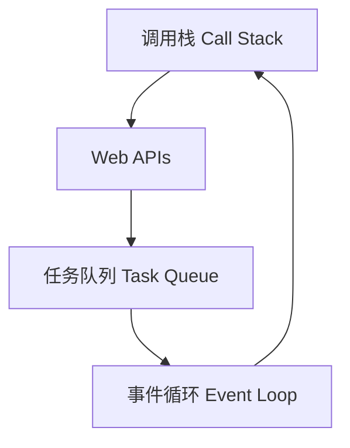
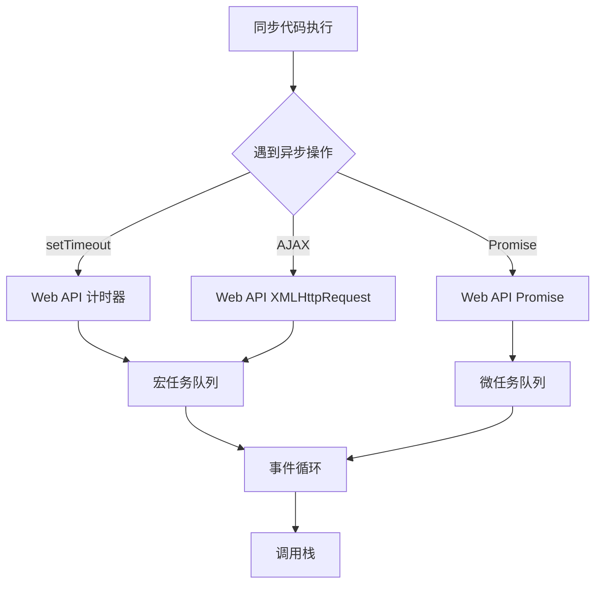

<!-- more -->
# js执行机制
<jsExecuteMachisum></jsExecuteMachisum>

# JavaScript 执行机制深度解析
## JavaScript 执行的核心原理
JavaScript 是一种单线程、非阻塞、异步并发的语言，其执行机制基于事件循环（Event Loop）模型。这种设计使 JavaScript 能够在单线程环境下高效处理异步操作。
### 核心概念解析

**1. 调用栈（Call Stack）：**
    - JavaScript 执行同步代码的地方
    - 后进先出（LIFO）结构
    - 当函数被调用时，被推入栈顶
    - 函数执行完毕后从栈中弹出
**2. Web APIs：**
    - 浏览器提供的异步功能接口
    - 包括 setTimeout、DOM 事件、AJAX 请求等
    - 当异步操作完成时，将回调函数放入任务队列
**3. 任务队列（Task Queue）：**
    - 存储待执行的回调函数
    - 分为宏任务队列和微任务队列
    - 事件循环按顺序处理队列中的任务
**4. 事件循环（Event Loop）：**
    - 持续检查调用栈是否为空
    - 当调用栈为空时，从任务队列中取出任务执行
    - 优先处理微任务队列中的所有任务
## 执行顺序规则
JavaScript 代码执行遵循特定顺序：
```
同步代码 > 微任务 > 宏任务
```
### 微任务（Microtasks）与宏任务（Macrotasks）
|任务类型|示例|执行时机|
|---|---|---|
|微任务|Promise.then/catch/finally<br>MutationObserver<br>queueMicrotask|在当前宏任务结束后立即执行<br>在下一个宏任务开始前执行|
|宏任务|setTimeout/setInterval<br>I/O 操作<br>UI 渲染<br>事件回调|在微任务队列清空后执行|


## 执行流程详解
```javascript
console.log('1'); // 同步代码

setTimeout(() => { // 宏任务
  console.log('2');
  new Promise(resolve => {
    console.log('3'); // 同步代码
    resolve();
  }).then(() => { // 微任务
    console.log('4');
  });
}, 0);

new Promise(resolve => {
  console.log('5'); // 同步代码
  resolve();
}).then(() => { // 微任务
  console.log('6');
});

console.log('7'); // 同步代码
//输出结果：1,5,7,6,2,3,4
```
### 执行步骤分析：
1. 同步代码执行阶段：
    - console.log('1') → 输出 1
    - new Promise 构造函数同步执行 → console.log('5') → 输出 5
    - console.log('7') → 输出 7
1. 微任务队列处理：
    - Promise 的 then 回调 → console.log('6') → 输出 6
1. 宏任务队列处理：
    - setTimeout 回调 → console.log('2') → 输出 2
    - new Promise 构造函数同步执行 → console.log('3') → 输出 3
    - Promise 的 then 回调（微任务）→ console.log('4') → 输出 4
### 最终输出顺序：
```
1
5
7
6
2
3
4
```

## 关键机制详解
### 1. 事件循环工作流程
```javascript
while (true) {
  // 1. 执行调用栈中的任务
  if (callStack.isEmpty()) {
    // 2. 执行所有微任务
    while (!microtaskQueue.isEmpty()) {
      execute(microtaskQueue.dequeue());
    }
    
    // 3. 执行一个宏任务
    if (!macrotaskQueue.isEmpty()) {
      execute(macrotaskQueue.dequeue());
    }
    
    // 4. 必要时进行UI渲染
    if (needRender) {
      updateRendering();
    }
  }
}
```
### 2. 异步操作处理流程

### 3. 微任务优先机制
微任务队列具有最高优先级，会在以下时机被处理：
- 在每个宏任务执行完毕后
- 在每次事件循环迭代开始时
- 在 UI 渲染之前
## 实际应用场景
### 1. Promise 与 setTimeout 执行顺序
```javascript
console.log('start');

setTimeout(() => {
  console.log('timeout');
}, 0);

Promise.resolve()
  .then(() => console.log('promise1'))
  .then(() => console.log('promise2'));

console.log('end');

// 输出顺序：
// start
// end
// promise1
// promise2
// timeout
```
### 2. 嵌套异步操作
```javascript
console.log('script start');

setTimeout(() => {
  console.log('setTimeout');
}, 0);

Promise.resolve()
  .then(() => {
    console.log('promise1');
    return Promise.resolve();
  })
  .then(() => {
    console.log('promise2');
    setTimeout(() => {
      console.log('setTimeout in promise');
    }, 0);
  });

console.log('script end');

// 输出顺序：
// script start
// script end
// promise1
// promise2
// setTimeout
// setTimeout in promise
```
## 性能优化建议
1. 避免阻塞事件循环：
    - 将长时间运行的任务拆分为小块
    - 使用 Web Workers 处理 CPU 密集型任务
1. 合理使用微任务：
    - 优先使用 Promise 而非 setTimeout
    - 避免在微任务中创建过多嵌套
1. 优化渲染性能：
    - 将 DOM 操作批量处理
    - 使用 requestAnimationFrame 进行动画更新
1. 避免过度嵌套：
    - 使用 async/await 简化异步代码
    - 合理使用 Promise.all 处理并行任务
## 浏览器与Node.js差异
|特性|浏览器环境|Node.js环境|
| --- |---|---|
|事件循环实现|基于浏览器渲染引擎|基于libuv库|
|微任务处理|每个宏任务后处理所有微任务|每个阶段后处理微任务队列|
|setImmediate|不支持|专用API，在I/O回调后执行|
|process.nextTick|不支持|Node特有，优先级高于微任务|
|UI渲染|每帧执行|不涉及|

```
为什么这样设计？

微任务优先级高于宏任务，确保在下一个宏任务开始前，所有微任务都被执行（例如Promise的状态更新）。
这样设计使得任务可以高效执行，同时保证任务执行的顺序可控。

如何记忆？

同步代码 > 微任务 > 宏任务
每次执行一个宏任务后，都会清空微任务队列。

示例代码验证：
你可以将上述代码复制到浏览器控制台运行，查看输出顺序。
```
**总结：**
JavaScript的执行机制依赖于事件循环和任务队列。理解调用栈、宏任务和微任务的执行顺序是掌握异步编程的关键。记住：同步代码立即执行，异步回调中微任务总是先于宏任务执行（在同一个事件循环中）。


[微任务与宏任务](microtasks-macrotasks.md)
