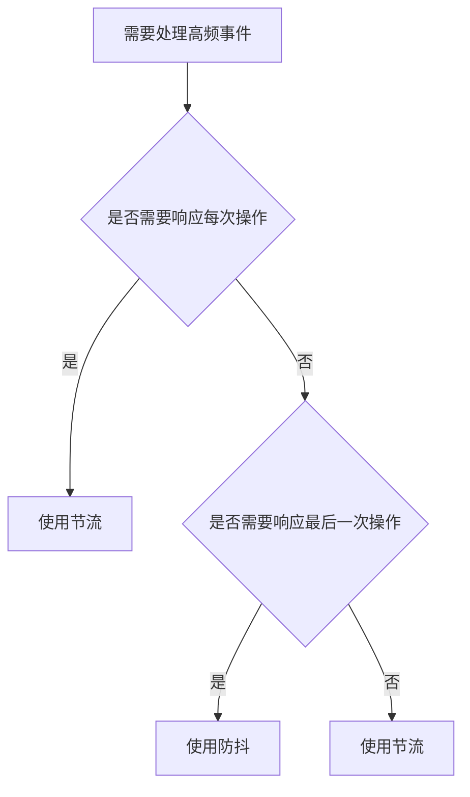

<!-- more -->
# 防抖节流的区别
# 防抖与节流技术详解
防抖（Debounce）和节流（Throttle）是两种常用的前端性能优化技术，主要用于控制函数执行频率。它们都能有效减少高频事件处理函数的调用次数，但实现原理和应用场景有所不同。
## 🚥 核心差异对比
|特性|防抖（Debounce）|节流（Throttle）|
| :----- | :----- | :---- |
|本质|延迟执行|稀释执行|
|执行时机|事件停止触发后|固定时间间隔|
|多次触发|只执行最后一次|均匀执行|
|保证响应|❌ 可能永远不执行（持续触发）|✅ 保证至少执行一次|
|应用场景|输入框验证、搜索建议|滚动加载、窗口调整、按钮防重复点击|
|水管比喻|等水流完全停止再响应|控制水流流量匀速释放|

## 🧩 技术实现与代码示例
### 防抖实现（Debounce）
```javascript
function debounce(fn, delay) {
  let timer = null;
  
  return function(...args) {
    // 每次触发都清除上一次的计时
    clearTimeout(timer); 
    
    // 重新设置计时器
    timer = setTimeout(() => {
      fn.apply(this, args);
    }, delay);
  };
}

// 使用示例：输入框搜索建议
const searchInput = document.querySelector('#search');
searchInput.addEventListener('input', debounce(() => {
  console.log('发送搜索请求', searchInput.value);
}, 500));
```
### 节流实现（Throttle）
```javascript
function throttle(fn, interval) {
  let lastTime = 0;
  
  return function(...args) {
    const now = Date.now();
    
    // 判断是否达到执行时间间隔
    if (now - lastTime >= interval) {
      fn.apply(this, args);
      lastTime = now;
    }
  };
}

// 使用示例：滚动加载
window.addEventListener('scroll', throttle(() => {
  console.log('检查滚动位置加载数据');
}, 1000));
```
## 📊 触发频率可视化分析
假设用户连续触发事件的时间点：
```
触发时间：|---●--●---●---●---●---●---> (时间轴)
```
防抖表现（延迟500ms）：
```
触发事件: ● ● ● ● ● ● ● ● ●
执行时机:                  ★ (停止触发500ms后执行)
```
节流表现（间隔500ms）：
```
触发事件: ● ● ● ● ● ● ● ● ●
执行时机:     ★     ★     ★ (每500ms执行一次)
```
## 🏆 经典应用场景
### 适合防抖的场景
**1. 文本输入验证**：等待用户停止输入后再检查格式
**2. 搜索框建议**：避免用户输入每个字符都发送请求
**3. 窗口大小调整结束**：等待调整完成后计算布局
**4. 自动保存功能**：停止编辑一段时间后保存
### 适合节流的场景
**1. 滚动事件处理**：滚动过程中定期检查位置
**2. 鼠标移动跟踪**：游戏中的鼠标位置更新
**3. 限制高频按钮点击**：防止用户连续提交表单
**4. 滑动操作反馈**：滑动过程中实时更新UI
## 🔍 高级实现技巧
### 带立即执行的防抖
```javascript
function debounce(fn, delay, immediate = false) {
  let timer = null;
  
  return function(...args) {
    const shouldCallImmediately = immediate && !timer;
    
    clearTimeout(timer);
    
    timer = setTimeout(() => {
      if (!immediate) fn.apply(this, args);
      timer = null;
    }, delay);
    
    if (shouldCallImmediately) {
      fn.apply(this, args);
    }
  };
}
```
### 带尾部执行的节流
```javascript
function throttle(fn, interval) {
  let lastTime = 0;
  let timer = null;
  
  return function(...args) {
    const now = Date.now();
    const remaining = interval - (now - lastTime);
    
    if (remaining <= 0) {
      if (timer) {
        clearTimeout(timer);
        timer = null;
      }
      fn.apply(this, args);
      lastTime = now;
    } else if (!timer) {
      timer = setTimeout(() => {
        fn.apply(this, args);
        lastTime = Date.now();
        timer = null;
      }, remaining);
    }
  };
}
```
## 🧪 实战选择建议
**1. 需要响应第一次操作** → 带立即执行的防抖
**2. 需要响应最后一次操作** → 防抖
**3. 需要均匀间隔响应** → 节流
**4. 需要保证至少执行一次** → 节流
**5. 高精度交互场景** → requestAnimationFrame
## 💡 可视化决策流程

理解防抖和节流的区别，可以根据具体业务需求选择合适的优化策略，显著提升应用性能与用户体验。