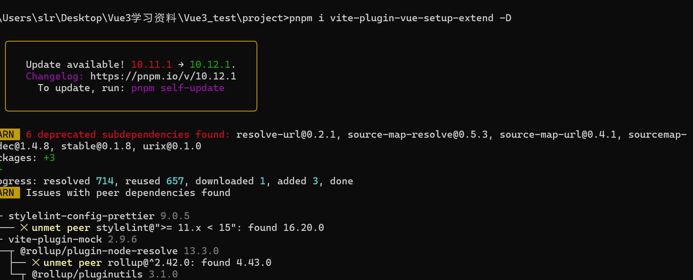

<!-- more -->
# Vue3定于组件名字的几种方法

## 方法一

使用两个组件标签

```
<script lang="ts">
export default({
    name:'myComponnet'
})
</script>

<script lang="ts" setup>

// 组件逻辑
</script>
```
## 方法二
```
使用defineOptions
<script>
defineOptions({
    name:'myComponnet'
})
</script>
```

## 方法三
使用插件 ：pnpm i vite-plugin-vue-setup-extend -D
