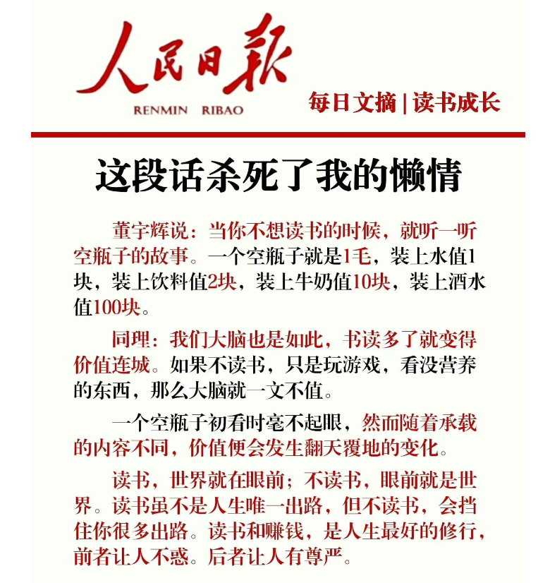

<!-- more -->
# 介绍页
:::info  每日一句
1.有时候人存在的意义，更多是觉醒和思考，而不仅仅是生存。
2.重复99次，只为第100次的蜕变。
3.平常心是道。
4.成为普通人和成为伟人，难度一样大。
5.所有命运馈赠的"舒适"，早在筹码堆里标好了售价。
6.提升自己比仰望别人更有意义。
7.生活从来不会因为你不接受就变好，我们唯一能做的，就是把碎掉的日子一片片捡起来，用体温焐干了，重新拼成像样的生活。
:::

::: tip  关于自我
这段话杀死我的懒惰
迷茫的时候多读书！这是我听到过最多的关于阅读时机和作用的概括。
可《人民日报》这段说辞我却第一次见。之前听到、看到很多视频和直播课程里说关于阅读的重要性，以及阅读和不阅读的人有什么区别之类的话题。
阅读除了解决迷茫，增长认知，大脑增值，填补谈资以外，还能让你在突发事件面前不在恐惧、犹豫不决之时更有决策力。
每天早起通勤过程中听会儿书或者晚上临睡前看几页，一年下来就是很大一个量哦。
坚持阅读相关分享和实践虽然时间不算太长，但是感悟颇多，希望阅读和写作会慢慢成为我生活中固定不变的一部分，因为它们是最基础、最好实践、成本最低的自我提升方式。
:::

::: note 其它
物理世界的我们是被禁锢的​，我们只能生活在此时、此地，经历一种人生。我们的所见所闻，受限于我们的出生、环境和时代。​阅读让我们成为“时空旅行者”​​，通过一本书，你可以瞬间穿越到古罗马的战场，漫步于唐朝的长安街头，或遨游在未来的星际宇宙。
阅读是突破思想的牢笼，获得独立思考的自由。我们天生就容易被困在自己的视角和固有的观念里，周围的环境和算法也在不断强化我们已有的认知，形成“信息茧房”。
:::