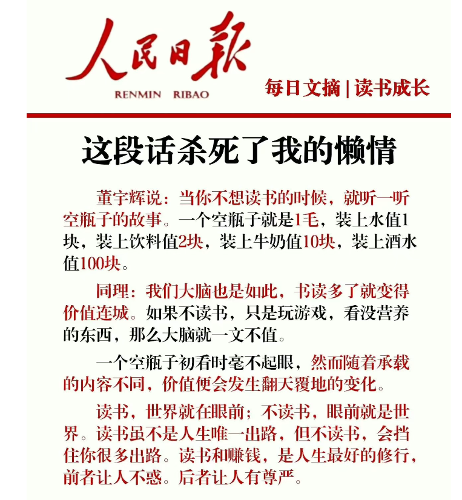

<!-- more -->

# 介绍页
一个不断摸索、持续学习的菜鸟。
:::info  吾日三省吾身
1.有时候人存在的意义，更多是觉醒和思考，而不仅仅是生存。
2.重复99次，只为第100次的蜕变。
3.平常心是道。
4.成为普通人和成为伟人，难度一样大。
5.所有命运馈赠的"舒适"，早在筹码堆里标好了售价。
6.提升自己比仰望别人更有意义。
7.生活从来不会因为你不接受就变好，我们唯一能做的，就是把碎掉的日子一片片捡起来，重新拼成像样的生活。
8.不断出错、不断遇到挫折，这是生活常态。
9.自律才是高级的快乐。
10.佛教智慧提醒：​执着于爱情如执取水中月影，看似真实却终不可得。
11.能用愚蠢的方式解决，就不要用恶意。
:::
<!--  -->

::: tip  关于阅读
迷茫的时候多读书！这是我听到过最多的关于阅读时机和作用的概括。
阅读除了解决迷茫，增长认知，大脑增值，填补谈资以外，还能让你在突发事件面前不在恐惧、犹豫不决之时更有决策力。
每天早起通勤过程中听会儿书或者晚上临睡前看几页，一年下来就是很大一个量哦。
坚持阅读相关分享和实践虽然时间不算太长，但是感悟颇多，希望阅读和写作会慢慢成为我生活中固定不变的一部分，因为它们是最基础、最好实践、成本最低的自我提升方式。
:::

::: important 其它
炙热的太阳，真暖；
盛开的桃花，真美！
:::