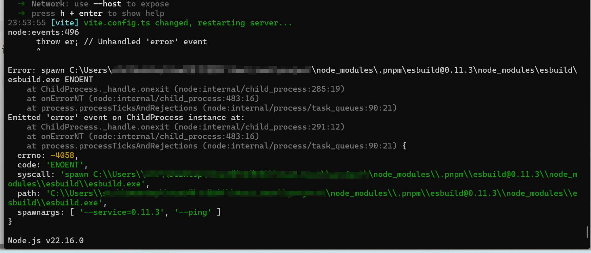
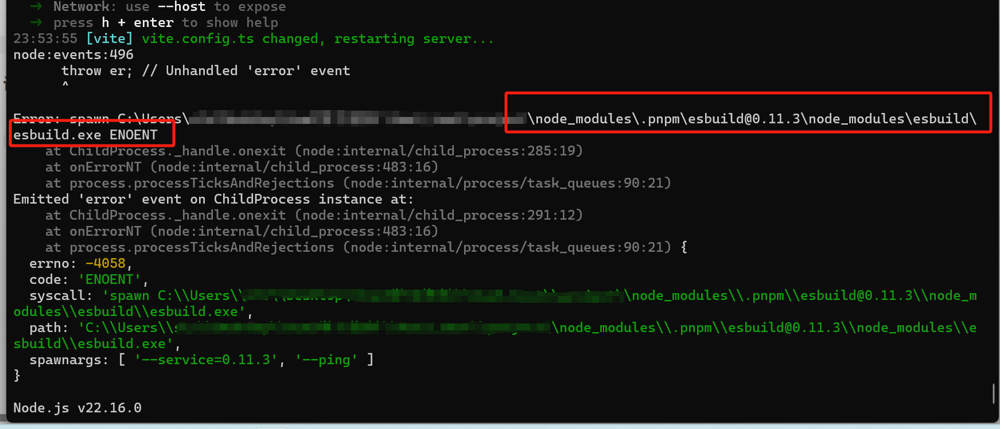
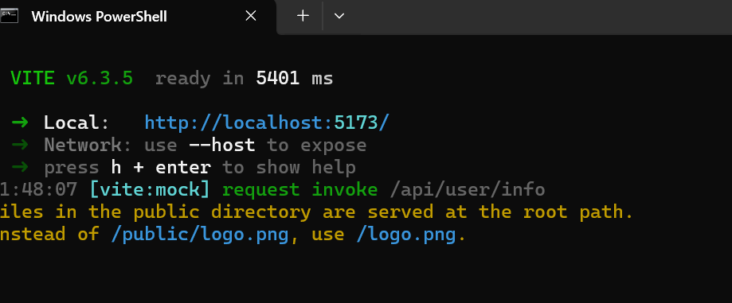

<!-- more -->
# 记一次vite项目无法启动的问题

## 问题描述
在启动vue3项目，项目构建工具使用的是vite，但当我满心欢喜一顿install、dev操作启动之后，发现报错了；

## 问题分析
跟随提示发现esbuild@0.11.3下没有esbuild.exe文件

## 解决方案
手动执行这个文件,node D:\project\node_modules.pnpm\esbuild@0.11.3\node_modules\esbuild\install
运行正常

